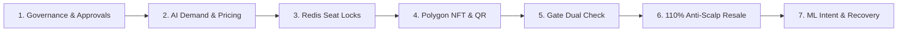

# 🎓 TicketLedger — FYP Final Demonstration & Evaluation Script
**Project**: TicketLedger (Phase 2 FYP) — Blockchain-Based Event Ticketing with Anti-Scalping ML & Cryptographic Turnstiles  
**Target Domain**: Pakistani Sports (PSL Cricket, Kabaddi) & Live Concerts / Music Festivals  
**Network**: Polygon Amoy Testnet (Chain ID `80002`) | **Backend**: Node.js Express & Python FastAPI | **Frontend**: React Vite

---

## 📋 Demo Roles & Credentials Cheat Sheet

All accounts have been populated with seed data and are ready for instant demonstration:

| Role | Email | Password | Persona & Purpose | Linked Wallet / Details |
|---|---|---|---|---|
| **Super Admin** | `admin@ticketledger.pk` | `Password@123` | Platform Governance & Security | `0x1111...1111` (Full Admin Powers) |
| **Approved Organizer** | `organizer@ticketledger.pk` | `Password@123` | Pakistan Cricket Board & Events | `0x2222...2222` (Host & Manage PSL / Concerts) |
| **Pending Organizer** | `pending.organizer@ticketledger.pk` | `Password@123` | Lahore Sufi & Rock Promotions | NTN `1234567-8` (Awaiting Admin Approval) |
| **Gate Staff** | `staff@ticketledger.pk` | `Password@123` | Gaddafi Stadium Turnstile Attendant | Gate 4 Turnstile Camera Validation |
| **Customer 1** | `customer@ticketledger.pk` | `Password@123` | Hamza Khan (Lahore) | Owns PSL Imran Khan VIP NFT Ticket |
| **Customer 2** | `customer2@ticketledger.pk` | `Password@123` | Ayesha Tariq (Karachi) | Owns PSL Ticket listed on 110% Resale |
| **Customer 3** | `customer3@ticketledger.pk` | `Password@123` | Bilal Ahmed (Rawalpindi) | Owns Scanned PSL Ticket (Gate Test) |
| **Fraud Bot** | `scalper.bot@proxyfarm.com` | `Password@123` | Scalper Bot Ring Alpha | **FROZEN** (Flagged 92/100 by ML) |
| **Abandoned User** | `omer.abandoned@gmail.com` | `Password@123` | Omer Farooq (Lahore) | Dropped off at checkout (1-Click Recoverable) |

---

## ⏱️ 12-Minute FYP Viva Demonstration Flow

---

### Act 1: Administrative Governance & Organizer Verification (2 mins)
1. **Sign in as Super Admin**: `admin@ticketledger.pk` / `Password@123`.
2. Navigate to **"Admin Command"** (`/admin/dashboard`):
   - Review top KPI overview (Total users, platform revenue in PKR, active NFT tokens, today's gate scans).
   - Go to **"Organizer Approvals"** tab:
     - Show **Lahore Live Entertainment** (`pending.organizer@ticketledger.pk`) in `PENDING` status.
     - Click **"View NTN Document"** to show document verification workflow.
     - Click **"Approve"** &rarr; Status transitions to `APPROVED` with instant audit log record.
   - Go to **"Manage Users"** tab:
     - Search `scalper.bot` to reveal **Scalper Bot Ring Alpha**.
     - Demonstrate `FROZEN` status and show admin action to `Unfreeze` or `Blacklist`.

---

### Act 2: Event Publishing & Pre-Launch AI Demand Forecasting (2 mins)
1. **Sign in as Organizer**: `organizer@ticketledger.pk` / `Password@123`.
2. Navigate to **"AI Demand Forecast"** (`/demand-forecast`):
   - Select **"PSL 10 Final: Lahore Qalandars vs Karachi Kings"**.
   - Show predicted first 48-hour ticket sales, gross revenue forecast in PKR, and projected demand level (`HIGH` / `VIRAL`).
   - Demonstrate the **AI Pricing Warning**:
     - Drag the price slider from PKR 5,000 to PKR 15,000 &rarr; System live triggers `HIGH_PRICE_WARNING` with projected velocity decrease.
     - Drag price to PKR 1,000 &rarr; System flags `UNDERPRICED_WARNING` suggesting revenue loss.
   - Show the **Suggested Launch Window** (e.g. *Thursday 6:30 PM PKT for Pakistani cricket fans*).

---

### Act 3: Interactive Seat Map, Atomic Redis Locking & Multi-Channel Checkout (2 mins)
1. **Sign in as Customer**: `customer4@ticketledger.pk` / `Password@123` (Zainab Fatima).
2. Navigate to **Browse Events** (`/events`) &rarr; Click **"PSL 10 Final"**:
   - Open the **Interactive Seat Map** (`/events/:id/seats`).
   - Select a seat in **VIP Imran Khan Enclosure (Row B, Seat 4)**.
   - Click **"Lock Seat"**:
     - System creates atomic 10-minute Redis lock (`lock:seat:...`) with TTL.
     - Across other browser tabs / users, the seat turns orange/red in real time.
3. Proceed to **Checkout** (`/checkout`):
   - Choose localized Pakistani payment method: **JazzCash**, **EasyPaisa**, or **Stripe**.
   - Click **"Complete Order"**.
   - Order succeeds with instantaneous backend emission of ticket issuance and notification.

---

### Act 4: Polygon Amoy ERC-721 NFT Tickets & Cryptographic QR Wallet (2 mins)
1. As Customer, navigate to **"NFT Tickets"** (`/my-nfts`):
   - Show minted ERC-721 ticket on **Polygon Amoy Testnet** (Chain ID `80002`).
   - Display `tokenId`, `txHash`, and clickable link to **PolygonScan Explorer**.
2. Open **"Digital QR Wallet"** (`/wallet`):
   - Show dynamic cryptographic QR code generated with HMAC-SHA256 signature and rolling 30-second nonce.
   - Click **"Download Verifiable PDF Ticket"** to inspect offline PDF ticket with anti-counterfeit watermarks.

---

### Act 5: Turnstile Gate Entry & Dual Security Validation (2 mins)
1. **Sign in as Gate Staff**: `staff@ticketledger.pk` / `Password@123`.
2. Navigate to **"Turnstile Scanner"** (`/scanner`):
   - Select venue gate: **Gate 4 (Imran Khan Enclosure)**.
   - **First Validation Test (Hamza's Ticket #101)**:
     - Scan QR code or enter ticket ID &rarr; Screen turns bright **GREEN** (**VALID FIRST SCAN**).
     - Live entry counter increments instantaneously via Socket.io.
   - **Duplicate Scan Test (Bilal's Ticket #103 - Already Scanned)**:
     - Scan ticket &rarr; Screen turns flashing **YELLOW** (**ALREADY SCANNED AT 19:42:10**).
     - Highlights double-entry prevention against shared screenshots.
   - **Fraudulent / Resold Ticket Test**:
     - Scan tampered nonce &rarr; Screen turns **RED** (**INVALID SCAN / TICKET TRANSFERRED**).

---

### Act 6: 110% Anti-Scalping Controlled Secondary Resale (1 min)
1. **Sign in as Customer**: `customer2@ticketledger.pk` / `Password@123` (Ayesha Tariq).
2. Navigate to **"Resale Market"** (`/resale`):
   - Show Ayesha's active PSL ticket listing for **PKR 5,500** (Primary price: PKR 5,000).
   - Point out the **110% Price Cap Rule**:
     - System mathematically rejects any listing exceeding `1.10 * face_value` (PKR 5,500).
     - Prevents black-market ticket scalping for sold-out cricket matches.
3. Switch to Customer 5 (`customer5@ticketledger.pk`), buy the resale ticket:
   - Ownership transfers on-chain, previous QR code is revoked, and new dynamic QR is generated for the buyer.

---

### Act 7: AI Purchase Intent Analytics & Abandoned Cart Recovery (1 min)
1. **Sign in as Organizer**: `organizer@ticketledger.pk` / `Password@123`.
2. Navigate to **"Abandoned Intent"** (`/analytics/abandoned`):
   - Show **Omer Farooq** (`omer.abandoned@gmail.com`) who viewed event, selected VIP seat, started checkout for PKR 7,500, but abandoned due to `PAYMENT_FRICTION`.
   - Point out ML Intent Score (65/100) and suggested action (`OFFER_JAZZCASH_EASYPAISA_DIRECT`).
   - Click **"Send Reminder"**:
     - Dispatches recovery notification with promo coupon `RECOVER10`.
     - In Omer's customer inbox, show received notification offering 10% discount to finalize purchase.
3. Navigate to **"Organizer Hub"** (`/organizer/dashboard`):
   - Show sales timeline bars, tier capacity fill rates, live gate ingress pacing, and AI predicted attendance turnout (92.4%).

---

## 🏆 Key Architectural Defenses (Summary for Viva Panel)

1. **Why Blockchain?** Eliminates counterfeit PDFs and duplicate entries; guarantees immutable provenance and enforces the 110% resale cap on-chain via Polygon Amoy smart contracts.
2. **Why Redis for Seats?** Relational databases bottleneck under high concurrency (e.g. 50,000 PSL fans hitting the seat map simultaneously). Redis atomic `SETNX` with key TTL guarantees zero double-bookings without database deadlocks.
3. **Why Dynamic QR Nonces?** Static QR codes can be screenshotted and shared across multiple attendees. TicketLedger dynamic QRs rotate nonces every 30 seconds, authenticated via HMAC-SHA256.
4. **Why Machine Learning?** Identifies scalper bot clusters through clickstream telemetry before they drain inventory, forecasts 48h launch demand, and recovers lost ticket revenues from abandoned checkouts.
