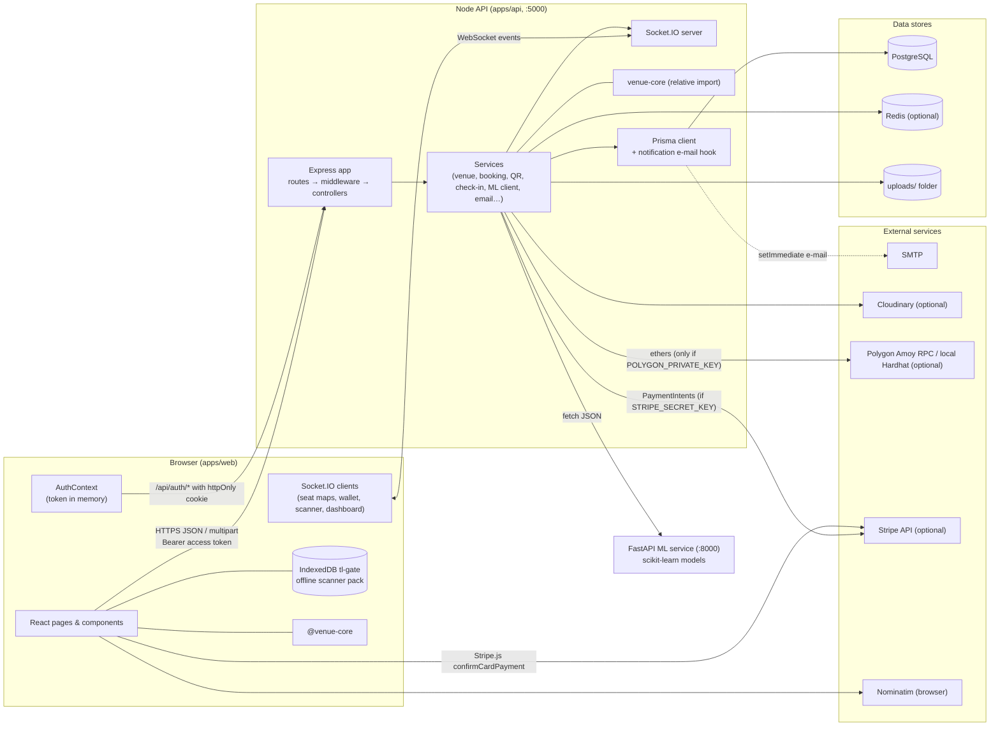
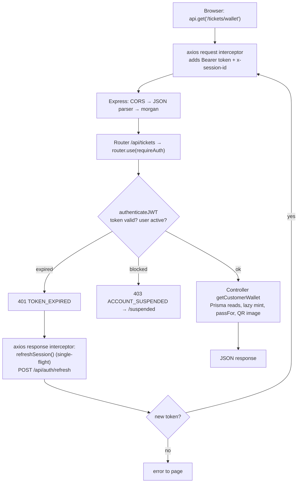

# Architecture and startup

[← Start here](README.md) · Next: [Modules](02-modules/README.md) · Related: [State, realtime & config](09-state-realtime-config.md) · [API catalogue](06-api-catalogue.md)

## 1. The parts and what each is responsible for

TicketLedger is a **monorepo** (one repository holding several applications) organised as npm workspaces (`apps/*`) plus a Hardhat project and a Python service.

| Part | Folder | Technology | Responsibility | Runs where |
|---|---|---|---|---|
| **Web app** | `apps/web` | React 18, Vite 5, React Router 6, axios, Socket.IO client, Leaflet, GSAP/Lenis, jsQR | Every screen for customers, organizers, gate staff and admins; seat maps; gate scanner with offline mode | **Browser** |
| **API** | `apps/api` | Node.js (ES modules), Express 4, Prisma 6, Socket.IO 4, ioredis, Zod, JWT, bcrypt, nodemailer, PDFKit, qrcode, ethers 6, multer, Cloudinary SDK | Authentication and sessions, business rules, persistence, seat holds, bookings, ticket passes, gate check-in, notifications/email, analytics, realtime events | **Backend** (Node process, port 5000) |
| **Venue core** | `apps/venue-core` | Plain JavaScript library | Venue geometry, deterministic seat generation, templates, layout validation — **imported by both** the API (relative import) and the web app (Vite alias `@venue-core`) | Browser **and** backend |
| **Database** | (schema in `apps/api/prisma/schema.prisma`) | PostgreSQL 16 | Source of truth for all data, including seat locks | **Database server** |
| **Redis** | — | Redis 7 | Optional fast first lock for the legacy per-seat flow; the API falls back to an in-memory map when Redis is down | **Cache server** (optional) |
| **ML service** | `apps/ml-service` | Python 3.10, FastAPI, scikit-learn, pandas | Fraud score, purchase-intent score, demand forecast; model (re)training on synthetic data | **Separate backend process** (port 8000), called only by the API |
| **Smart contract** | `contracts` | Solidity 0.8.24, Hardhat, OpenZeppelin | ERC-721 ticket NFT with a stored 110 % resale cap | **Blockchain** (Polygon Amoy testnet) — only when configured; otherwise minting is simulated |
| **Infrastructure** | `infra/docker-compose.yml` | Docker Compose | PostgreSQL and Redis containers for development | Local machine |

External services the code can talk to: **SMTP** (Gmail or other) for e-mail, **Cloudinary** for uploads (optional, falls back to local disk), **Stripe** (card payments in test mode — the API creates/retrieves PaymentIntents when `STRIPE_SECRET_KEY` is set, and the browser loads Stripe.js to confirm the card), **Polygon Amoy RPC** or a local Hardhat node (optional), **OpenStreetMap Nominatim** (address search/reverse geocoding, called **directly from the browser** in `LocationPicker`), **Google Fonts** and **Unsplash** images (browser), **Google Maps** links (browser, links only).

## 2. Architecture diagram



Text version:
```
Browser (React)  --HTTP JSON + Bearer JWT-->  Express API  --Prisma-->  PostgreSQL
      |  \--/api/auth with httpOnly refresh cookie--^      |---ioredis--> Redis (optional)
      |                                                    |---fetch----> FastAPI ML service
      '<====== Socket.IO events (seat changes, check-ins, staff revocation) =====|
                                                           |---nodemailer--> SMTP
                                                           |---ethers------> Polygon (only if configured)
```

## 3. How the parts communicate

| From → To | Channel | What travels | Code |
|---|---|---|---|
| Web → API | HTTP (axios instance `utils/api.js`, global axios, `fetch`) | JSON requests; `Authorization: Bearer <access JWT>`; `x-session-id` (behaviour session) | [`web-core`](functions/web-core.md) |
| Web → API (auth) | HTTP `fetch` with `credentials: 'include'` | Login/verify/refresh/logout; cookies `tl_refresh` (path `/api/auth`) and `tl_pending_signup` | `AuthContext.authRequest` |
| API → Web | Socket.IO broadcast or rooms | `seat:status_change`, `seat:status_batch`, `venue:published`, `ticket:checked-in`, `checkin:stats`, `staff:access-revoked`, `notification` | [Realtime](09-state-realtime-config.md#3-socketio-events) |
| API → PostgreSQL | Prisma client, some raw SQL | All persistent data and seat locks | [`config/prisma.js`](functions/api-core.md#api-config-prisma) |
| API → Redis | ioredis | Keys `seat:lock:<seatId>` (legacy seat flow only) | [`config/redis.js`](functions/api-core.md#api-config-redis) |
| API → ML service | `fetch` POST JSON, no auth, no timeout | Feature payloads; scores back | [`mlService.js`](functions/api-analytics-ml.md#api-ml-checkfraudrisk) |
| API → SMTP | nodemailer (or in-memory JSON transport) | OTP, invites, contact form, notification e-mails | [`emailService.js`](functions/api-notifications-email.md) |
| API → Polygon | ethers v6 | `mintTicket` (only with private key) | [`nftService.js`](functions/api-resale-transfer-nft.md#api-nft-mintticketnft) |
| Browser ↔ IndexedDB | WebCrypto + IndexedDB | Offline ticket pack, queued scans | [`gateOffline.js`](functions/web-core.md#srclibgateofflinejs--scanner-offline-store-indexeddb-tl-gate) |

There is **no message queue and no scheduled job runner** in the repository. Background-like work happens in four ways only: (1) lazy cleanup at request time (`venueService.expireStaleHolds`); (2) `setImmediate` e-mail after a notification insert; (3) fire-and-forget promises (behaviour tracking); (4) browser timers (token refresh, polling, scanner sync).

---

## 4. Startup sequences

### 4.1 API process (`npm run dev` in `apps/api` → `node --watch src/server.js`)

```mermaid
sequenceDiagram
  participant N as node
  participant S as server.js
  participant A as app.js
  participant C as config modules
  participant R as Redis
  N->>S: load module
  S->>A: import app.js
  A->>C: import routes → controllers → services → config (prisma, redis, socket…)
  C-->>C: PrismaClient created (no DB connection yet — Prisma connects lazily on first query)
  C-->>C: ioredis client created with lazyConnect (not connected)
  C-->>C: emailService runs dotenv.config(); nftService creates a JSON-RPC provider object
  A->>A: dotenv.config(); register CORS, JSON parsers, morgan, /api/health, /uploads, 19 routers, 404, error handler
  S->>S: http.createServer(app); new Socket.IO Server(cors); setIO(io); register connection handlers
  S->>S: process guards (unhandledRejection / uncaughtException only log)
  S->>R: startServer(): await connectRedis()
  R-->>S: connected → redisConnected = true, or failure → warning, in-memory locks
  S->>N: server.listen(PORT || 5000)
```

Numbered:
1. `server.js` imports `app.js`; the import graph pulls every route, controller, service and config module. Module-level side effects at this point: Prisma client construction (`config/prisma.js`), Redis client construction (`config/redis.js`, lazy), `emailService` and `mlService` call `dotenv.config()`, `nftService` builds an ethers provider (and a signer only if `POLYGON_PRIVATE_KEY`), `storage.js` decides once whether Cloudinary is configured, `rateLimit.js` reads `AUTH_RATE_LIMIT_MAX`.
2. `app.js` body runs `dotenv.config()` and registers middleware and routes in the order listed in [API core](functions/api-core.md#api-app). Because imports run before this body, config that must see `.env` reads it lazily inside functions (`getJwtSecret`, `corsOrigin`, `FRONTEND_URL()`…).
3. `server.js` wraps the app in an HTTP server, attaches Socket.IO with the same CORS rule and stores it with `setIO` so controllers can emit without importing `server.js`.
4. Socket connection handler registers `join_user_room`, `join_event_room`, `leave_event_room`, `disconnect`.
5. `startServer()` awaits `connectRedis()` (never throws), then `listen`.
6. Not done at startup: no DB connectivity check (the first query connects; a DB outage surfaces as 500s), no ML service check, no SMTP verification (transport is created on first send), no QR key load (generated/loaded on first pass signature), no scheduled jobs.

`GET /api/health` reports API status, the live Redis flag and environment.

### 4.2 Web app (`npm run dev` in `apps/web` → Vite on :5173)

1. `index.html` loads fonts and `src/main.jsx`.
2. `main.jsx` renders `<App/>` inside `React.StrictMode`.
3. Importing `utils/api.js` imports `lib/session.js`, which **at import time** replaces `window.fetch` with the refresh-aware wrapper and installs the axios interceptor (`installFetchInterceptor`, `installAxiosInterceptor(axios)`).
4. `App` builds the provider tree: `BrowserRouter → AuthProvider → DialogProvider → WishlistProvider`, then global behaviours (`SelectEnhancer`, `SmoothScroll`, `AwayTitle`, `SplashScreen`, `ScrollToTop`, `RouteLoader`) and the routed page plus `HoldBar`.
5. **Authentication restoration** (`AuthProvider` startup effect): removes legacy `localStorage.tl_token`; if `localStorage.tl_last_active` is older than 30 min, calls `/api/auth/logout` and stays signed out; otherwise `POST /api/auth/refresh` with the httpOnly cookie (retrying once after 300 ms). Success → access token in memory, `user` set; `loading` becomes false. Until then `ProtectedRoute` shows a spinner.
6. After sign-in: a timer refreshes the token 60 s before expiry; activity listeners keep `tl_last_active` fresh; a 15-second check signs out after 30 idle minutes; `WishlistProvider` loads `/api/wishlist/ids`; `HoldBar` and `HeaderAccount` start polling holds and notifications.
7. **Realtime connections are opened per page**, not globally: `VenueBooking`/`LegacySeatMap` (seat events), `DigitalWallet` (`ticket:checked-in`), `GateScanner` (event room, stats, revocation), `OrganizerDashboard` (`checkin:stats`). The unused `NotificationBell` is the only notification listener.

### 4.3 ML service (`python main.py` in `apps/ml-service`)
Imports training modules, creates the FastAPI app with open CORS, `load_models()` reads any `models/*.joblib` present, then Uvicorn listens on :8000. See the [model-file status warning](functions/ml-service.md#model-file-status-on-this-machine-verified-2026-10-06-by-running-the-code).

### 4.4 Data stores
`docker-compose -f infra/docker-compose.yml up -d` starts PostgreSQL and Redis. Then in `apps/api`: `npx prisma db push` (create tables), `npm run seed` (demo data and published venue plans), optionally `npm run create-admin`.

### 4.5 Smart contract (optional)
In `contracts/`: `npx hardhat test`; deploy with `npx hardhat run scripts/deploy.cjs --network amoy` (the npm script points to a missing `.js` file). The API only mints on-chain if `POLYGON_PRIVATE_KEY` and `TICKET_NFT_CONTRACT_ADDRESS` are set in `apps/api/.env`.

---

## 5. Request lifecycle (one protected API call)



## 6. Responsibility boundaries — browser vs backend vs database vs external

| Concern | Browser | Backend | Database | External |
|---|---|---|---|---|
| Authentication | Keeps access token in memory; refresh timer; idle sign-out; route guards (UI only) | Verifies JWT on every request and re-reads user status; issues/rotates refresh tokens | `RefreshToken`, `OtpCode`, `User` | SMTP for codes |
| Seat availability | Renders plan from `venue-core`, patches from socket events | Holds/releases with atomic SQL; lazy expiry | `Seat` lock columns | — |
| Pricing | Displays, shows server-recalculated total | Computes order totals from tier prices | `TicketTier` | — |
| Payment | Collects OTP for wallets; card details go into Stripe's `CardElement` and are confirmed by Stripe.js (never reach the API) | `paymentService`: Stripe PaymentIntent create/retrieve when configured, otherwise and for JazzCash/EasyPaisa **simulated** | `Order` | Stripe (test mode, optional) |
| Ticket pass | Displays QR PNG; offline verification with public key | Signs Ed25519 passes, renders QR/PDF | `Ticket.qrVersion`, `manualCode` | — |
| Gate | Camera decode, offline queue | Verdict + atomic admission, logs | `CheckIn`, `GateScan`, `Ticket` | — |
| NFT | Shows token data | Mints (simulated by default) | `Ticket` token fields | Polygon (optional) |
| Analytics/AI | Sends telemetry, shows dashboards | Rule-based scoring; calls ML service | `BehaviorEvent` | ML service |
| Location | Map, Nominatim lookups | Stores lat/lng | `Event` | Nominatim, Google Maps links |
