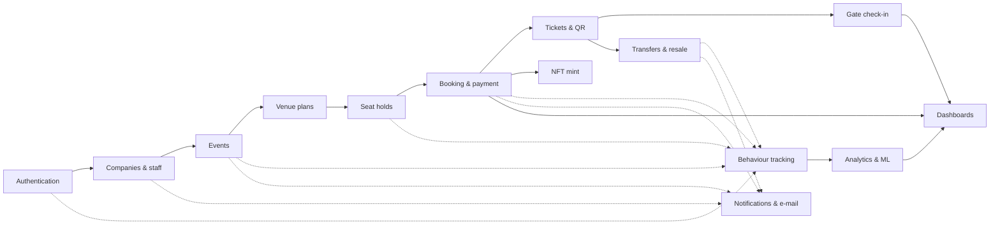

# Modules — behind the scenes

[← Start here](../README.md) · Previous: [Architecture](../01-architecture.md) · Next: [Journeys](../03-journeys.md)

Each module page starts with a short overview, then explains how the implementation works: a numbered execution sequence, a diagram, a table mapping each step to its exact file and function, the data that changes, failure behaviour, gaps observed in the code, and a worked example with fictional data. Full per-function detail lives in the [function catalogue](../functions/README.md).

| Module | Page | Main code | Status summary |
|---|---|---|---|
| Authentication, sessions & roles | [authentication.md](authentication.md) | `authController`, `tokenService`, `otpService`, `middlewares/auth.js`, `AuthContext`, `lib/session.js` | Implemented end to end |
| Companies & gate staff | [companies-staff.md](companies-staff.md) | `companyController`, `staffController`, `StaffManager` | Implemented |
| Events, media, approval, wishlist | [events.md](events.md) | `eventController`, `eventReviewController`, `eventMediaService`, `CreateEvent`, `EventDetails` | Implemented; some pricing endpoints loosely checked |
| Venue plans & seating | [venues-seating.md](venues-seating.md) | `apps/venue-core`, `venueService`, `VenueEditor`, `VenueBooking` | Implemented (current); legacy grid still supported |
| Seat locking & holds | [seat-locking-holds.md](seat-locking-holds.md) | `venueService.hold*`, `seatController.lockSeat`, `config/redis.js` | PostgreSQL atomic locks; Redis optional (legacy) |
| Booking, checkout & payment | [booking-payment.md](booking-payment.md) | `bookingController`, `paymentService`, `Checkout` | Booking real; anti-bot check on every checkout; **Stripe test mode** when configured (server enforcement incomplete); wallets simulated |
| Tickets, QR passes & PDF | [tickets-qr.md](tickets-qr.md) | `qrPassService`, `ticketController`, `ticketPdf` | Implemented (Ed25519); legacy HMAC unused |
| Gate check-in | [gate-checkin.md](gate-checkin.md) | `checkinService`, `GateScanner`, `gateOffline` | Implemented incl. offline mode; `/api/gate` legacy |
| Transfers, resale & waitlist | [transfers-resale.md](transfers-resale.md) | `ticketTransferController`, `resaleController` | Implemented; resale has **no payment** and a race |
| Blockchain / NFT | [blockchain-nft.md](blockchain-nft.md) | `nftService`, `contracts/` | Contract real; **minting simulated by default** |
| Behaviour analysis & AI | [behavior-analytics-ml.md](behavior-analytics-ml.md) | `behaviorService`, `intentAnalyticsService`, `mlService`, `apps/ml-service` | Tracking real; most scores **rule-based**; models only for demand forecast |
| Notifications & e-mail | [notifications-email.md](notifications-email.md) | `config/prisma.js` hook, `emailService`, `notificationService` | In-app + e-mail real; socket UI unused; push mocked |
| Dashboards & governance | [dashboards-admin.md](dashboards-admin.md) | `organizerDashboardService`, `adminService` | Implemented; some figures heuristic |
| Frontend shell | [frontend-shell.md](frontend-shell.md) | `App.jsx`, shells, global behaviours | Route table and storage keys |

