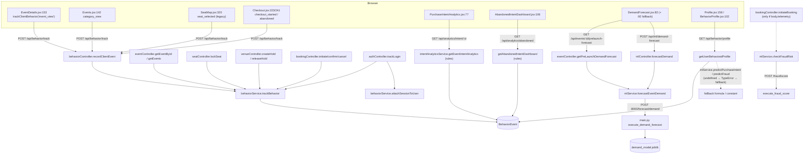

# Module: Behaviour analysis, intent analytics & AI (ML)

[← Modules](README.md) · Function details: [behaviour & ML (API)](../functions/api-analytics-ml.md) · [ML service (Python)](../functions/ml-service.md) · Journey: [organizer analytics](../03-journeys.md#journey-9--organizer-analytics-forecast-intent-abandoned-carts)

## Overview (short)

TicketLedger records what visitors do (views, seat selections, checkouts…) as rows in `BehaviorEvent`, shows funnels and "intent" lists to organizers, and has a separate Python service with three scikit-learn models (fraud, purchase intent, demand). **In the running web app, almost all "AI" numbers are produced by hand-written rules in the Node API.** The trained models are only reached by the Demand Forecast page, and even there only if the ML service is running with model files in the right format; otherwise fixed fallback values are returned.

---

## 1. What actually exists

| Capability shown in the UI | What really computes it | Model? |
|---|---|---|
| Behaviour tracking (timeline, counts) | `behaviorService.trackBehavior` inserts rows; `getUserBehavioralProfile` counts them | No — storage and counting |
| "Purchase intent" score on Profile / Behaviour page | Fallback formula in `getUserBehavioralProfile` (the ML call targets a function that does not exist) | **No** (always the fallback) |
| "Fraud risk" on Profile / Behaviour page | Constant 14 / LOW (same broken call) | **No** |
| Event funnel and "users likely to buy" (Purchase Intent page) | Rules in `intentAnalyticsService.getEventIntentAnalytics` | No |
| Abandoned-cart list, likely reason, recoverable revenue | Rules in `getAbandonedIntentDashboard` | No |
| Organizer attendance / no-show prediction | Fixed numbers per event type and city in `organizerDashboardService` | No |
| Fraud feeds (organizer dashboard, admin alerts) | Display of seed rows (`bot_risk_flagged`, `rapid_clicks`) and `checkout_abandoned` rows; default scores 60–88 when missing | No |
| Fraud watchlist (admin) | Stored results of `POST /api/ml/fraud/score` (`AI_BOT_EVALUATION`) — no web page calls that endpoint | Model if the ML service works; else Node heuristic |
| Checkout bot blocking | `initiateBooking` calls `mlService.checkFraudRisk` whenever the request contains `telemetry`; since `87aa15d`/`f991cc5` the web checkout **always** sends it (time on the checkout page, click rate; a fixed bot profile with `?bot` or `window.simulateBot()`) | Model if the ML service loads it; else Python heuristic or Node fallback rules (the usual case locally) |
| Pre-launch demand forecast | `eventController.getPreLaunchDemandForecast` → ML service `/forecast/demand`; suggested launch time and price warnings are rules | **Yes, if available**; else 78 % capacity fallback |
| Model retraining | `POST /api/ml/train/:type` (admin, no UI) → Python `/train/*` | Training on synthetic CSVs |

**Algorithms in the Python service** (`apps/ml-service/scripts/`):
- Fraud: `CalibratedClassifierCV(RandomForestClassifier)` on 8 purchase features → probability of fraud.
- Intent: `GradientBoostingRegressor` → a 0–100 score.
- Demand: `GradientBoostingRegressor` (48-hour sales) + `RandomForestClassifier` (demand level).
- Training data: **synthetic**, generated by formulas in `generate_synthetic_data.py` (no real user data, no external dataset). The model learns those formulas back, which explains the near-perfect metrics in `model_metrics.json`.
- No external AI API (no LLM, no hosted inference) is used anywhere.

## 2. Where every part lives

| Role | File → function |
|---|---|
| Client session id | `apps/web/src/utils/api.js` → `getClientSessionId` (localStorage `tl_session_id`), request interceptor adds `x-session-id` |
| Client-side tracking | `utils/api.js` → `trackClientBehavior` ← `EventDetails` (`event_view`), `Events` (`category_view`), `SeatMap` legacy (`seat_selected`), `Checkout` (`checkout_started` on open, `checkout_abandoned` on discard), `BehaviorProfile` (simulator) |
| Receive client events | `routes/behaviorRoutes.js` `POST /track` → `behaviorController.recordClientEvent` |
| Server-side tracking | `behaviorService.trackBehavior` called from auth, events, seats, venue holds (select/lock/release), booking, transfers, resale, wallet, legacy gate |
| Store | table `BehaviorEvent` (`userId?`, `sessionId`, `action`, `eventId?`, `metadata` JSON, `createdAt`) |
| Link guest → user | `behaviorService.attachSessionToUser` ← `authController.trackLogin` (on login/signup/verify/invite) |
| Profile aggregation | `behaviorService.getUserBehavioralProfile` ← `GET /api/behavior/profile` |
| Event funnel & intent | `intentAnalyticsService.getEventIntentAnalytics` ← `GET /api/analytics/intent/:eventId` |
| Abandoned carts | `intentAnalyticsService.getAbandonedIntentDashboard` ← `GET /api/analytics/abandoned` |
| Reminders | `sendAttendeeReminder`, `sendAbandonedCartReminder` (+ batch) → `notificationService.dispatchNotification` |
| Model client | `services/mlService.js` → `checkFraudRisk`, `forecastEventDemand`, `scorePurchaseIntent`, `triggerModelTraining` |
| Model HTTP endpoints | `apps/ml-service/main.py` → `execute_fraud_score`, `execute_intent_predict`, `execute_demand_forecast`, `/train/*` |
| Model loading | `main.py` → `load_models()` (joblib, at import and on demand) |
| Training | `scripts/train_fraud_model.py` `train_fraud`, `train_intent_model.py` `train_intent`, `train_demand_model.py` `train_demand`; data from `scripts/generate_synthetic_data.py`; evaluation `scripts/evaluate_models.py` |
| Saved models | `models/fraud_model.joblib`, `intent_model.joblib`, `demand_model.joblib` (**git-ignored**; local copies are legacy-format), `models/model_metrics.json` (committed) |
| Legacy trainer | `train_models.py` (incompatible format; superseded) |
| Using results | `eventController.getPreLaunchDemandForecast` → `DemandForecast.jsx`; `bookingController.initiateBooking` (block on `CRITICAL_BOT`); `mlController.checkFraud` → watchlist |

## 3. What starts the process

| Trigger | What runs | When |
|---|---|---|
| Any page view of an event, a filtered events list, a legacy seat lock, a checkout start/confirm/cancel, login, transfer, resale list/view, wallet link | `trackBehavior` insert | **After every such request**, fire-and-forget |
| `trackClientBehavior` from the browser | `POST /api/behavior/track` → insert | On those page actions |
| Organizer opens Purchase Intent / Abandoned pages | Aggregation over all rows of the event(s) | **On demand** (each page load); no caching, no pre-computation |
| Customer/admin opens Profile → behaviour, or the Behaviour page | `getUserBehavioralProfile` over the latest 100 rows | On demand |
| Organizer opens Demand Forecast for an event | `forecastEventDemand` → ML HTTP call | On demand (and on each "simulate price") |
| Checkout start **with** `telemetry` in the body | `checkFraudRisk` | Not triggered by the web app |
| Admin calls `/api/ml/train/:type` | Python retraining (synchronous) | Manual |
| **Scheduled analysis** | — | **None exists** (no cron/queue) |

## 4. Call chains (definition → call sites → trigger)

| Step | Definition | Caller (file → function) | Original trigger |
|---|---|---|---|
| Insert behaviour row | `behaviorService.js:45 trackBehavior` | `behaviorController.js:18 recordClientEvent`; `eventController.js:301 getEvents`, `:375 getEventById`; `seatController.js:240,253 lockSeat`; `bookingController.js:280 initiateBooking`, `:380,504,517 confirmBooking`, `:655 cancelBooking`; `authController.js:156 trackLogin`; `ticketTransferController.js:151`; `resaleController.js:145,329`; `userController.js:286`; `gateController.js:37` | Page actions / API requests |
| Client tracking | `utils/api.js:40 trackClientBehavior` | `EventDetails.jsx:153`, `Events.jsx:142`, `SeatMap.jsx:320`, `BehaviorProfile.jsx:118` | Page load / clicks |
| Attach session | `behaviorService.js:88` | `authController.js:154 trackLogin`; `behaviorController.js:96` (no web caller) | Login, signup, OTP verify, invite accept |
| Profile | `behaviorService.js:112` | `behaviorController.js:45, :72` | `Profile.jsx:158`, `BehaviorProfile.jsx:102` |
| Funnel | `intentAnalyticsService.js:8` | `intentAnalyticsController.js:9`; `intentAnalyticsService.js:372` (batch) | `PurchaseIntentAnalytics.jsx:77` |
| Abandoned | `intentAnalyticsService.js:415` | `intentAnalyticsController.js:89`; `:774` (batch) | `AbandonedIntentDashboard.jsx:106` |
| Demand client | `mlService.js:110` | `eventController.js:562`; `mlController.js:79` | `DemandForecast.jsx:82`, `:92` |
| Demand inference | `main.py:234` | `main.py:417 post_forecast_demand` (HTTP) | Node `fetch` |
| Fraud client | `mlService.js:9` | `bookingController.js:63` (needs telemetry); `mlController.js:15` | No web trigger |
| Intent client | `mlService.js:177` | `mlController.js:124` only | No web trigger |
| Training | `scripts/train_*.py` | `main.py:436/455/474` (HTTP), or command line | Admin API call / manual |

**Exists but not connected to the app:** `scorePurchaseIntent` and the Python intent model (no web path); the fraud model (no web path); `attendance_no_show.csv` (no trainer, no reader); `train_models.py` (incompatible output); `getUserBehaviorProfileById`/`attach-session` endpoints (no web caller); `NOTIFICATION_TYPES`-based reminder copy referencing a discount code that checkout does not implement.

## 5. The data

**Collected per behaviour row** (`trackBehavior`): `userId` (or null for guests), `sessionId` (from `x-session-id`, else derived), `action` string, `eventId` (optional), `metadata` = caller's fields **plus** `ip`, `userAgent`, `timestamp`. Examples of caller metadata: `event_view {eventName, category, city}`; `seat_locked {seatId, section, row, seatNumber, price}`; `checkout_started {orderId, totalAmount, seatCount, paymentMethod}`; `login {method, email}`.

> Note: `initiateBooking` additionally inserts its own `checkout_started` row directly with Prisma (`bookingController.js:265`) **and** calls `trackBehavior(CHECKOUT_STARTED)` (`:280`) — two rows per checkout start. Event views and category views are typically recorded twice (client + server).

**Aggregation (event funnel), per person** — key = `userId || sessionId`:
- counters: `views` (event_view), `seatSelections` (seat_selected or seat_locked), `checkoutStarts`, `checkoutAbandons`, `payments`, `tickets` (+ successful orders from `Order`).
- No time window: **all rows ever recorded for the event** are used. No normalisation, no decay.
- Missing values: guests have no user → shown as "Guest Attendee" and excluded from reminders.

**Feature preparation for the demand model** (Node → Python):

| Stage | Example structure |
|---|---|
| Event in DB | `{type:'CRICKET_MATCH', city:'Lahore', date:'2026-11-14', tiers:[{price:1500,totalQuantity:500},{price:5000,totalQuantity:100}]}` |
| Node computes (`getPreLaunchDemandForecast`) | capacity = max(600, 15000) = **15000**; avgPrice = (1500+5000)/2 = **3250**; dayOfWeek from date; isWeekend = Fri/Sat/Sun |
| `mlService.forecastEventDemand` payload | `{event_type:'CRICKET_MATCH', city:'Lahore', marketing_tier:'HIGH', venue_capacity:15000, avg_ticket_price:3250, ticket_prices:3250, is_weekend:1, day_of_week:'Saturday', publish_hour:18}` |
| Python fills missing (`execute_demand_forecast`) | `marketing_score` 92 (HIGH), `popularity_score` 90 (HIGH), `day_of_week` kept |
| Model input row (DataFrame) | `event_type, city, venue_capacity, ticket_prices, day_of_week, publish_hour, popularity_score, marketing_score` |
| Pipeline preprocessing | numeric → `StandardScaler`; `event_type`, `city`, `day_of_week` → one-hot (unknown categories ignored) |

Event types the models were not trained on are mapped first (`mlService.mlEventType`: hockey → football, qawwali/theatre/conference → concert, general admission → festival).

## 6. How the models work (plain language)

- **Gradient boosting regressor (demand sales, intent score):** builds 120 small decision trees one after another; each new tree corrects the errors of the trees before it; the prediction is the sum of their outputs.
- **Random forest classifier (demand level, fraud):** 100 decision trees trained on random samples of the data vote; the share of votes is a probability. For fraud, `CalibratedClassifierCV` adjusts those vote shares so they behave more like real probabilities.
- **Training vs. inference:** training (scripts) reads CSV → 70/15/15 split → fits a `Pipeline(preprocessor, model)` → saves a dictionary `{pipeline(s), features, metrics, training_metadata}` with joblib. Inference (`main.py`) loads that dictionary once into memory and calls `pipeline.predict` / `predict_proba` on a one-row DataFrame per request.
- **Interpreting outputs:** demand → `projected_48h_sales` (clipped to capacity), `sellout_probability` = sales ÷ capacity, `demand_tier` by thresholds 0.70 / 0.55 / 0.40 (or `VERY_HIGH` whenever marketing tier is HIGH); fraud → score = probability × 100, ≥ 75 `CRITICAL_BOT` (block), ≥ 45 `SUSPICIOUS`; intent → ≥ 70 HIGH, ≥ 40 MODERATE.

## 7. How the app uses the results

| Result | Received in | Decision code | Effect |
|---|---|---|---|
| Demand forecast | `getPreLaunchDemandForecast` | Adds rule-based publish time and pricing warning (benchmarks 3000/4000/1500/2500, ×1.35 and ×0.70 thresholds) | Shown on `DemandForecast.jsx`; organizer may change prices (`PUT /pricing`). Nothing is enforced. Stored? **No** (only the `/api/ml/demand-forecast` path stores an `AI_DEMAND_FORECAST` row). |
| Fraud (checkout) | `initiateBooking` | `risk_level === 'CRITICAL_BOT'` → 403 `blockedByAI` + AuditLog; always stores `CHECKOUT_BOT_EVALUATION` row | Blocks checkout with a red notice listing the anomaly signals; reachable from every web checkout (normal users score low; see [booking](booking-payment.md#anti-bot-check--how-a-normal-customer-is-scored)). |
| Fraud (API) | `mlController.checkFraud` | `is_bot` → AuditLog `SCALPER_BOT_FLAGGED` | Appears in the admin Fraud Watchlist; admin may freeze the account (`SUSPENDED` + sessions revoked) — a manual decision. |
| Intent / abandoned lists (rules) | analytics pages | thresholds 55/75, reasons | Organizer clicks "Send reminder" → notification + e-mail + socket + mock push. |
| Profile scores (fallback) | Profile/Behaviour pages | — | Display only. |

No result affects access control automatically except the checkout block.

## 8. Failure behaviour

| Situation | What happens | Handling present? |
|---|---|---|
| Behaviour insert fails | Logged warning, request continues | Yes (`trackBehavior` catch) |
| ML service down / connection refused | `fetch` throws → Node fallback values (`fallback:true`) | Yes |
| ML service hangs | `fetch` has **no timeout** → the organizer's request waits until the socket errors | **Missing** |
| Model file missing | Python heuristic branch | Yes |
| Model file in wrong format (current local state) | Python raises → HTTP 500 → Node fallback | Indirectly (no explicit format check) |
| Unknown city/event type | One-hot `handle_unknown='ignore'`; types mapped in Node | Yes |
| Python training error | HTTP 500 with detail → Node 500 | Yes |
| Behaviour profile ML call | Always throws (`predictPurchaseIntent` undefined) → fallback | Masked bug |
| Very large behaviour tables | Analytics load every row for an event each request | **No pagination/time window** |
| `/api/behavior/track` abuse | Any client may post any action string (optionalAuth, no rate limit) | **Missing validation** |

## 9. Worked example (fictional data; outputs computed by hand from the code, **not** produced by running the app)

Fictional visitor "Sana" (registered) and a guest session browse fictional event *Lahore Night Run* (`eventId E1`, one tier PKR 2,000).

1. Sana opens the event page twice. Each load: browser `trackClientBehavior('event_view')` → row; server `getEventById` → row. **4 `event_view` rows** (2 per visit).
2. She opens seats (venue plan) and holds a seat → `createHold` → **`seat_selected` + `seat_locked`** (since `690ea08`).
3. She opens checkout → the page posts `checkout_started` (`cartValue` 2000); she presses *Confirm order* → `initiateBooking` writes **2 more `checkout_started` rows** (3 in total). She then abandons by closing the tab; the order is later expired by `expireStaleHolds` (no `checkout_abandoned` row is written by expiry — had she removed the seat instead, `releaseHold` would have written one).
4. A guest session `sess_x` views the page once → 2 `event_view` rows with `userId=null`.

**Organizer opens Purchase Intent for E1** (`getEventIntentAnalytics`):
- Sana: views 4 (≥3 → +15), seatSelections 2 (+20), checkoutStarts 3 (+25), abandons 0, not bought → 40+15+20+25 = 100, capped at **99 → HIGH**, action `SEND_LIMITED_OFFER_REMINDER`; also listed under "abandoned" (`CHECKOUT_STAGE`).
- Guest: views 2 → 40 → LOW (not in "likely to buy").
- Funnel: viewed 2, seat selected 1 (checkout implies seat), checkout 1, paid 0, issued 0 → conversion 0 %.

**Abandoned dashboard** (`getAbandonedIntentDashboard`) for Sana: 45 +10 (≥2 views) +15 (seat selected) +20 (checkout) = **90**; cart value: her latest row is a server `checkout_started` with `totalAmount` but no `cartValue` → 2 × 2500 = **PKR 5,000** (fallback, see bug note); reason: not explicit, < 7000, she started checkout, views 4 → **`COMPARISON_SHOPPING`**.

Organizer clicks *Send reminder* → `sendAbandonedCartReminder` → `dispatchNotification` → `Notification` row ("Your seats for Lahore Night Run are waiting!", code RECOVER10) → e-mail via the Prisma hook (if Sana has e-mail notifications on) → Socket.IO `notification` to `user_<Sana>` (no visible listener in the current UI; she sees it in the header within 60 s via polling).

**Demand forecast for E1** (ML service working, dictionary-format models): Node sends capacity 15000 (minimum applied), price 2000, HIGH marketing… → Python model returns e.g. *sales ≈ N* (value depends on the trained model — illustrative only) → tier `VERY_HIGH` (because marketing tier HIGH) → Node adds "Wednesday at 5:00 PM PKT" (not sports/music) and, since 2000 < 0.70 × 2500 = 1750 is false and 2000 ≤ 1.35 × 2500, **`OPTIMAL_PRICE`**. If the ML service is unreachable: sales = 0.78 × 15000 = **11,700**, revenue PKR 23,400,000, tier HIGH.
