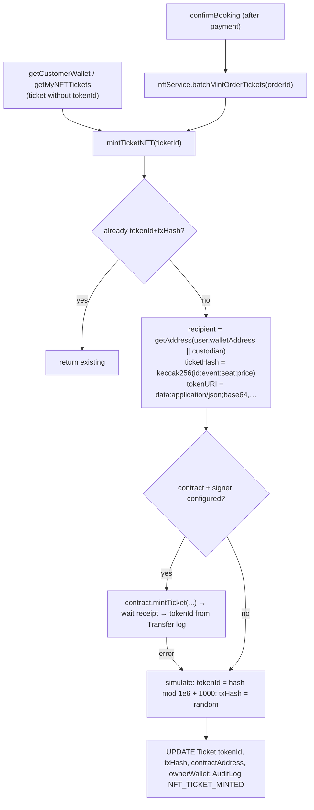

# Module: Blockchain / NFT tickets

[← Modules](README.md) · Functions: [NFT service & contract](../functions/api-resale-transfer-nft.md#nftservicejs--nft-minting-simulated-unless-configured)

## Overview — what is real and what is simulated

| Piece | Status |
|---|---|
| Solidity contract `TicketLedgerNFT` (ERC-721, 110 % cap stored per token, duplicate-seat guard, minters, invalidation) | **Implemented and tested** with Hardhat (6 tests) |
| Deployment | Script exists (`scripts/deploy.cjs`); npm script points to a missing `deploy.js`; **no deployed address committed** |
| Minting from the API | `nftService.mintTicketNFT` calls `contract.mintTicket(...)` **only if** `POLYGON_PRIVATE_KEY` (and a contract address) are set. Otherwise — and in every default setup — it **simulates**: token id derived from a keccak hash, `txHash` = random 32 bytes |
| Local chain (since `cc26c42`) | Hardhat `localhost` network (chain 31337) added; root scripts `scripts/test_live_mint.mjs`, `test_blockchain_scenarios.mjs`, `mint_to_user.mjs` and `demo_live_checkout_to_metamask.mjs` exercise minting against a local node at `127.0.0.1:8545` with the contract at the first Hardhat deployment address. They are manual developer scripts, not part of the app (see [scripts](../functions/scripts-tests-infra.md#root-scripts-folder-manual-demo-scripts)). The Profile page always switches MetaMask to **Polygon Amoy**, not to the local chain |
| Env names | API reads `POLYGON_AMOY_RPC`, `POLYGON_PRIVATE_KEY`, `TICKET_NFT_CONTRACT_ADDRESS`, `PLATFORM_CUSTODIAN_WALLET`; `.env.example` lists different names (`POLYGON_RPC_URL`, `DEPLOYER_PRIVATE_KEY`, `NFT_CONTRACT_ADDRESS`, `MARKETPLACE_CONTRACT_ADDRESS`) that nothing reads |
| Token metadata | Embedded as a base64 `data:` URI (no IPFS) |
| Transfers / resale on-chain | **Not implemented** (DB only) |
| Resale cap enforcement | **API-side** (`floor(price × 1.10)`); `validateResalePrice` on-chain is never called |
| Wallet linking | MetaMask `eth_requestAccounts` in `Profile.jsx`, saved via `PUT /api/users/wallet`; **no signature proving ownership** |
| "Blockchain logs" admin tab | Lists `Ticket` rows from PostgreSQL |

## Behind the scenes (mint)

| # | Step | File → function |
|---|---|---|
| 1 | Trigger after payment | `bookingController.confirmBooking` (try/catch) |
| 2 | Lazy trigger | `ticketController.getCustomerWallet`, `getMyNFTTickets` |
| 3 | Provider/signer | `NFTService.initProvider` (at import) |
| 4 | Metadata | `generateMetadata` |
| 5 | On-chain or simulated mint | `mintTicketNFT` |
| 6 | Contract function | `TicketLedgerNFT.mintTicket` (`contracts/contracts/TicketLedgerNFT.sol:84`) |

## Failure behaviour
RPC/contract error → warning, simulated values stored (the ticket then *looks* minted, with a Polygonscan link that will not resolve). Minting errors never fail a booking. `getMyNFTTickets` includes unpaid placeholder tickets and may "mint" them (simulated).

## Worked example (fictional)
Ticket T1 (price 3000, seat S1, event E1, buyer without wallet). No private key configured → `ticketHash = keccak256("T1:E1:S1:3000")` → `tokenId = (hash mod 1,000,000) + 1000` (e.g. 482,117 — illustrative), `txHash = 0x<64 random hex>`, `ownerWallet = custodian address`, `contractAddress = 0x9a8F…0F21` (hard-coded default). Wallet badge: "Verified ERC721 NFT Pass"; `isLiveOnChain: false` in `/my-nfts`.
