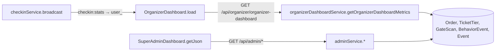

# Module: Organizer & Super Admin dashboards (governance)

[← Modules](README.md) · Functions: [admin & organizer services](../functions/api-analytics-ml.md#organizerdashboardservicejs) · Pages: [OrganizerDashboard, SuperAdminDashboard, AdminCompanies, AdminEventApprovals, AdminFraudWatchlist](../functions/web-pages.md#organizer-studio)

## Overview
- **Organizer dashboard** (`/organizer/dashboard`): revenue (minus a fixed 5 % platform fee), daily sales chart, tier sell-through, live gate turnout, a rule-based attendance prediction, a fraud feed, event cards with setup/edit/delete actions, and staff management.
- **Super Admin dashboard** (`/admin/dashboard`): platform metrics and tabs for users (status changes), events (delete), transactions, "blockchain logs", fraud alerts, gate scans and audit logs; plus separate pages for company approvals, event approvals and the ML fraud watchlist.

## Behind the scenes
| Panel | Data source | Computation |
|---|---|---|
| Revenue | `Order` SUCCESSFUL | sum; fee = round(5 %); net |
| Sales graph | same | grouped by order date |
| Tiers | `TicketTier` | sold = total − available (**includes unpaid checkouts** until they expire) |
| Gate pacing | `GateScan` | counts by result (current check-in mirrors into `GateScan`) |
| Live turnout | Socket `checkin:stats` (from `checkinService.broadcast`) → refetch at most every 2 s | |
| Attendance prediction | Event type/city only | fixed rates (88.5 default, cricket 92.4, music 86.8, kabaddi 89.1, +2 Lahore/Karachi); "confidence 0.91" is a constant |
| Fraud feed | `BehaviorEvent` actions `bot_risk_flagged`, `rapid_clicks`, … | seed data only |
| Admin metrics | 15 counts/aggregates | `adminService.getSuperAdminMetrics` |
| Admin user status | `PUT /api/admin/users/:id/status` | `adminService.updateUserStatus`: allowed statuses, protect other admins, revoke sessions when blocking, audit, `SYSTEM_ALERT` notification |
| Fraud alerts tab | `BehaviorEvent` incl. every `checkout_abandoned` | default scores 65/88; `minScore` ignored |
| Fraud watchlist page | `AI_BOT_EVALUATION` rows | freeze/unfreeze buttons |

## Failure behaviour
Organizer without company → `hasCompany:false` view; selecting an event outside the company → 403; admin endpoints → 403 for non-admins.

## Gaps (observed)
`/api/admin/*` is also reachable under `/api/organizer/*` (same guards); "high-risk" counts equal totals because `minScore` is ignored; "blockchain logs" are database rows; fee percentage is hard-coded.

## Worked example (fictional)
Event with 2 SUCCESSFUL orders (PKR 6,000 and 3,000) and 1 pending checkout of 2 seats: revenue 9,000, fee 450, net 8,550; tier "sold" counts 3 paid + 2 pending = 5 until the pending order expires; one GREEN scan → turnout = round(1/5 × 100) = 20 %.
