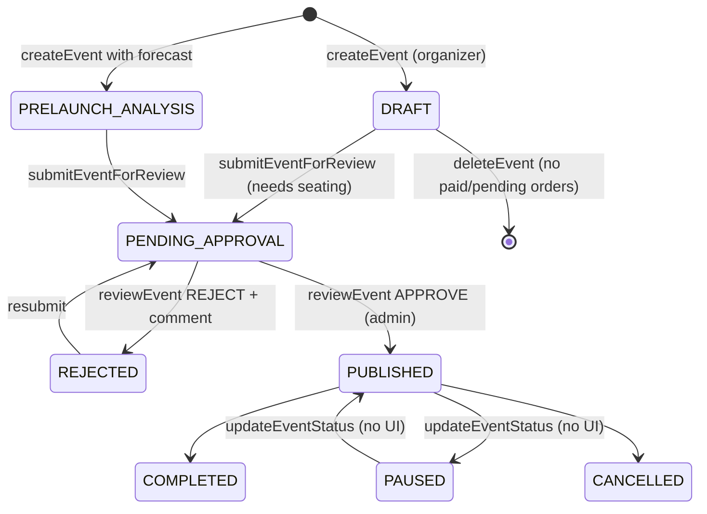

# Module: Events — creation, media, approval, discovery, wishlist

[← Modules](README.md) · Functions: [events API](../functions/api-events.md) · Pages: [CreateEvent, EventSubmit, Events, EventDetails](../functions/web-pages.md) · Journeys: [3](../03-journeys.md#journey-3--organizer-company-approval-event-creation-and-submission), [8](../03-journeys.md#journey-8--admin-review-and-governance)

## Overview

An approved organizer creates an event in **five steps**: (1–3) the create form (details, images & map location, ticket tiers), (4) the venue editor (seating plan), (5) Review & submit. A Super Admin then approves (event goes `PUBLISHED`, on sale) or rejects with a comment. Customers discover published events on the homepage, Explore page, map and category pages and can save them to a wishlist.

## Status life-cycle

Super Admins creating events may set any status directly (e.g. `PUBLISHED`).

## Behind the scenes — creation with images

| # | Step | File → function |
|---|---|---|
| 1 | Company approved? (UI) | `ProtectedRoute requireApprovedCompany`, `CreateEvent` → `GET /companies/my-company` |
| 2 | Step validation | `CreateEvent.validateStep` / `goTo` |
| 3 | Image checks in browser; cropping | `ImageField` / `GalleryField` → `checkImageFile`; `ImageCropper.apply` |
| 4 | Location | `LocationPicker` (Leaflet + Nominatim search/reverse) |
| 5 | Submit multipart | `CreateEvent.createEvent` → `POST /api/events` |
| 6 | Guards | `authenticateJWT → requireRole → requireApprovedOrganizer → eventMediaUpload (multer)` |
| 7 | Server image validation (from bytes) then upload | `eventMediaService.uploadEventImages` → `validateEventImage` → `inspectImage` → `uploadFile` |
| 8 | Transaction: event + gallery + tiers + audit | `eventController.createEvent` |
| 9 | Notification | `EVENT_CREATED` |
| 10 | Next step | navigate to venue editor (or Demand Forecast) |

**Editing** (`PUT /api/events/:id`): details, location, single images (`replace`/`remove`/`keep`) and a full gallery order in one request; files are validated and uploaded before the DB transaction; old files are left in storage. Tiers cannot be changed here (prices via Demand Forecast `PUT /pricing`; quantities come from the venue plan).

**Submission:** `GET /submission` reports readiness (submittable status + published plan or legacy seats); `POST /submit` sets `PENDING_APPROVAL`, notifies all active admins (`EVENT_REVIEW_REQUEST`) and the organizer. **Review:** `AdminEventApprovals` → `POST /api/admin/event-reviews/:id` with a conditional update so two admins cannot both decide.

**Discovery:** `GET /api/events` returns only `PUBLISHED` by default with min/max price and total available; filters by type, city, text, date window, price. `GET /api/events/:id` hides non-public events from everyone except the owner/admin (preview). Both record behaviour events.

**Deletion:** allowed only without `SUCCESSFUL` or `PENDING` orders; cascades remove tiers, seats, layouts, gallery, wishlist/waitlist rows, invites and staff assignments.

**Wishlist:** `WishlistContext.toggle` → optimistic heart → `POST/DELETE /api/wishlist/:eventId`; only public events can be saved/listed.

## Media rules (same values in API and web)
| Placement | Ratio | Minimum | Max size |
|---|---|---|---|
| Card | 4:3 | 800×600 | 5 MB |
| Banner | 20:9 | 1600×720 | 8 MB |
| Gallery wide | 2:1 | 1400×700 | 8 MB |
| Gallery (≤12) | 1:1 | 700×700 | 5 MB |
| Venue plan | any | 1000×600 (long/short) | 10 MB |
Ratio tolerance ±10 %; max 8000 px per side, 40 MP; JPEG/PNG/WebP detected from bytes.

## Failure behaviour
Zod/media errors → 400 with readable messages; unknown gallery ids or missing upload positions → 400; multer limits → 400; delete with orders → 409; non-owner → 403/404.

## Gaps (observed)
`updateEventPricing`/`publishEventWithPricing` update tiers by id without checking the tier belongs to the event; `publishEventWithPricing` does not publish; `PATCH /:id/status` has no UI and cannot set `PENDING_APPROVAL`; `GET /api/events` ignores `limit`; suspended companies' events stay published.

## Worked example (fictional)
Tariq (approved company) creates *Lahore Night Run* on 2026-11-14 19:00, tiers "General" 1500×500 and "VIP" 5000×100, banner 2400×1080 → event `DRAFT`, tiers available 500/100, banner stored as `/uploads/event_media/<time>_<rand>.jpg` → venue editor publishes 580 sellable seats (tiers recomputed to e.g. 480/100) → submit → admin approves → `PUBLISHED`; it appears on `/events` with "From PKR 1,500".
