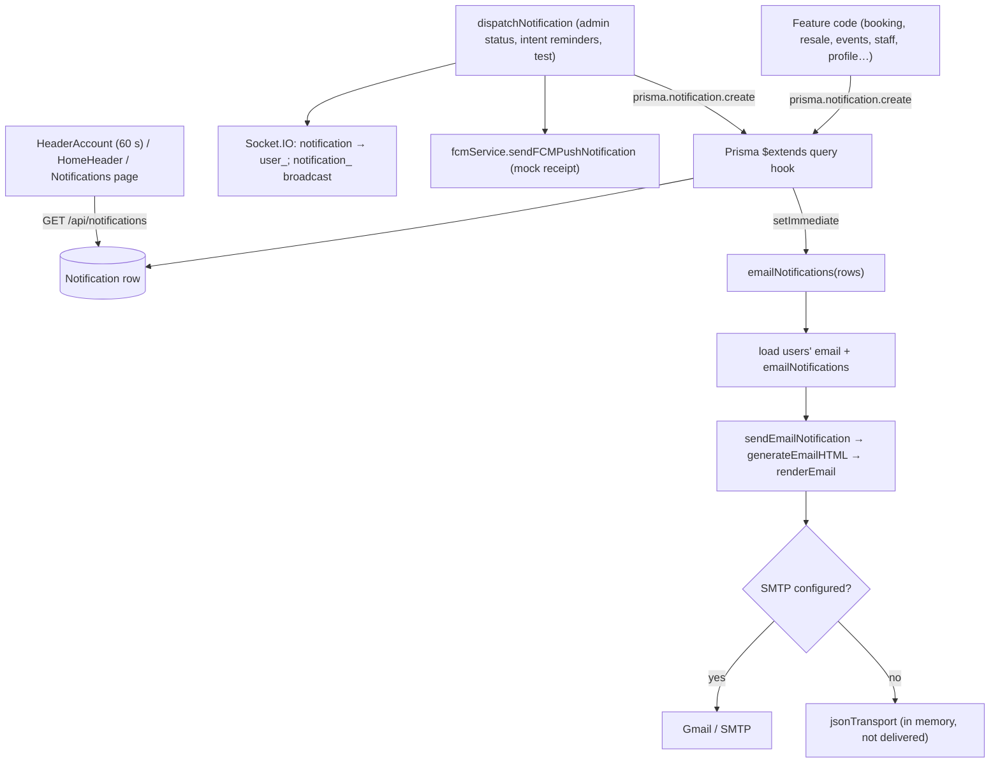

# Module: Notifications, e-mail, push & contact

[← Modules](README.md) · Functions: [notifications & e-mail](../functions/api-notifications-email.md) · [Prisma e-mail hook](../functions/api-core.md#api-config-emailnotifications)

## Overview

Every user-facing activity creates a `Notification` row. A **Prisma client extension** intercepts every `notification.create`/`createMany` and, after the response, e-mails each notification to its user (if they have an e-mail and have not switched e-mail notifications off). The web app shows notifications by **polling** (header every 60 s, Notifications page on load). Socket.IO and "push" channels exist in code but are not visible in the current UI: the only socket listener is in the unused `NotificationBell`, and FCM push is a mock.

## Behind the scenes

| # | Step | File → function |
|---|---|---|
| 1 | Create row | any of 21 `prisma.notification.create` call sites, or `notificationService.dispatchNotification` |
| 2 | Hook | `config/prisma.js` `$extends({query:{notification:{create, createMany}}})` |
| 3 | E-mail after response | `emailNotifications` (`setImmediate`) |
| 4 | Button target by type prefix | `actionFor(type)` (`ACTIONS` regex list) |
| 5 | Send | `emailService.sendEmailNotification` → `getTransporter` |
| 6 | Read in UI | `HeaderAccount.loadNotifications`, `HomeHeader` unread badge, `Notifications.fetchNotifications` |
| 7 | Mark/delete | `notificationController.markNotificationAsRead/markAll/delete` |

**Other e-mails** (sent directly, not via notifications): OTP codes (`sendOtpEmail`), staff invites (`sendStaffInviteEmail`), contact form (`contactController.sendContactMessage` → support inbox with `Reply-To`). All share `emailLayout.renderEmail` (table-based HTML with the inline CID logo).

## Notification types in use
`BOOKING_CONFIRMED`, `ORGANIZER_REGISTRATION`, `ORGANIZER_STATUS_UPDATE`, `EVENT_CREATED`, `EVENT_UPDATED`, `EVENT_DELETED`, `EVENT_SUBMITTED`, `EVENT_REVIEW_REQUEST`, `EVENT_APPROVED`, `EVENT_REJECTED`, `EVENT_SEATING_SAVED`, `RESALE_LISTED`, `RESALE_CANCELLED`, `RESALE_TICKET_AVAILABLE`, `RESALE_TICKET_SOLD`, `RESALE_TICKET_PURCHASED`, `TICKET_RECEIVED`, `TICKET_TRANSFERRED`, `STAFF_ACCESS_REVOKED`, `STAFF_REACTIVATED`, `PROFILE_UPDATED`, `PASSWORD_CHANGED`, `WALLET_UPDATED`, `SYSTEM_ALERT` (admin status change), `EVENT_REMINDER` / `ABANDONED_CHECKOUT_REMINDER` (organizer reminders), plus the ten `NOTIFICATION_TYPES` accepted by the test endpoint.

## Configuration
`SMTP_HOST`, `SMTP_PORT`, `SMTP_SECURE`, `SMTP_USER`, `SMTP_PASS`, `MAIL_FROM` (or `FROM_EMAIL`/`EMAIL_FROM`), `SUPPORT_EMAIL`, `FRONTEND_URL` (links). Placeholder values containing `mock` switch to the in-memory transport; under the Node test runner real SMTP is always disabled.

## Failure behaviour
E-mail errors never fail requests (hook catches; OTP sender falls back to console in non-production). Contact form send failure → 502. Unknown user in `dispatchNotification` → throws to the caller (reminder batches count it as not sent).

## Gaps (observed)
Real-time notification UI not wired (socket listener only in unused component); `notification_<userId>` is broadcast to all sockets; any signed-in user can call `POST /api/notifications/test` for any `targetUserId`; FCM tokens kept in memory; `smsNotifications` preference exists but no SMS code.

## Worked example (fictional)
Admin approves Tariq's event → `reviewEvent` inserts `EVENT_APPROVED` → hook → `setImmediate` loads Tariq (`emailNotifications: true`) → e-mail "[TicketLedger] “Lahore Night Run” is approved and on sale" with button "Open organizer dashboard" (`/organizer/dashboard`, matched by `^EVENT_(…APPROVED…)`) → Tariq's header badge updates at the next 60-second poll.
