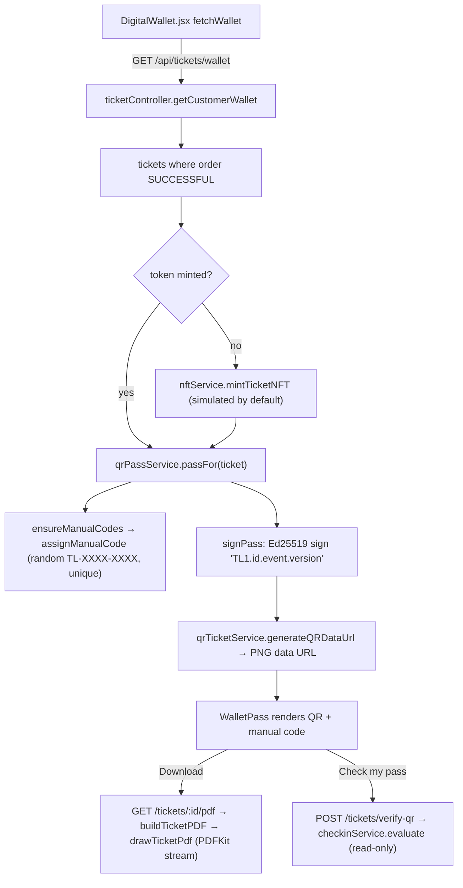

# Module: Ticket issuance, QR passes & PDF

[← Modules](README.md) · Functions: [tickets, QR & gate](../functions/api-tickets-qr-gate.md) · Journey: [5](../03-journeys.md#journey-5--wallet-qr-display-pdf-and-pass-check)

## Overview

A ticket is a `Ticket` row created at checkout start (placeholder) and made valid when its order becomes `SUCCESSFUL`. The customer's wallet shows, for every paid ticket, a **signed gate pass** — a short text `TL1.<ticketId>.<eventId>.<qrVersion>.<signature>` rendered as a QR image — plus a human-typeable **manual code** `TL-XXXX-XXXX`. Passes are generated on demand and never stored. The same pass is printed in the downloadable **PDF ticket**.

**Why a signature:** the server signs passes with an **Ed25519 private key**; gate devices receive only the public key, which can verify but never create passes, so a stolen scanner cannot forge tickets. **Why `qrVersion`:** each transfer/resale increments it, so screenshots held by the previous owner fail ("Old QR").

## Behind the scenes

| # | Step | File → function |
|---|---|---|
| 1 | Wallet request | `DigitalWallet.fetchWallet` |
| 2 | Paid tickets only | `getCustomerWallet` (`order.status = SUCCESSFUL`) |
| 3 | Lazy mint | `nftService.mintTicketNFT` |
| 4 | Manual code | `qrPassService.ensureManualCodes` / `assignManualCode` |
| 5 | Key load | `qrPassService.loadKeys` (env `QR_SIGNING_PRIVATE_KEY` or dev key file `apps/api/.keys/qr-ed25519.pem`, generated on first use) |
| 6 | Sign | `qrPassService.signPass` |
| 7 | QR image | `qrTicketService.generateQRDataUrl` (`qrcode`, ECC level H) |
| 8 | PDF | `ticketController.downloadTicketPDF` → `buildTicketPDF` → `loadEventPhoto` (fetch banner / fallback photo, 4 s timeout) → `drawTicketPdf` |
| 9 | Live "used" state | Socket `ticket:checked-in` to `user_<owner>` (from check-in) → wallet greys out the QR |

**Data:** reads `Ticket`, `Order`, `Event`, `Seat`, `TicketTier`; writes `Ticket.manualCode` (first time / after transfer) and token fields (lazy mint), `AuditLog` (mint).

## Legacy QR system (not used by the UI)
`qrTicketService` also contains an older HMAC-SHA256 JSON pass (static and a 30-second rotating "dynamic" variant) checked against `Ticket.qrNonce`, plus `processGateScan`. Only `/api/gate/*` and test scripts use it.

## Failure behaviour
Missing production key → throws when signing (500); unpaid ticket → excluded from wallet / 409 on `/qr`; PDF image fetch failure → next candidate or no photo; errors after the PDF stream started cannot return JSON.

## Worked example (fictional)
Ticket `3f2a…` for event `9c1e…`, `qrVersion 1`. Wallet builds `TL1.3f2a….9c1e….1` and signs it → `TL1.3f2a….9c1e….1.<86-char base64url signature>`; manual code assigned `TL-7K3M-9QX2`. After Hina transfers it to Omar, `qrVersion` becomes 2 and `manualCode` is cleared; Omar's wallet gets `TL1.….2.<sig>` and a new code; Hina's old QR is rejected at the gate with "Old QR: this ticket was transferred".
