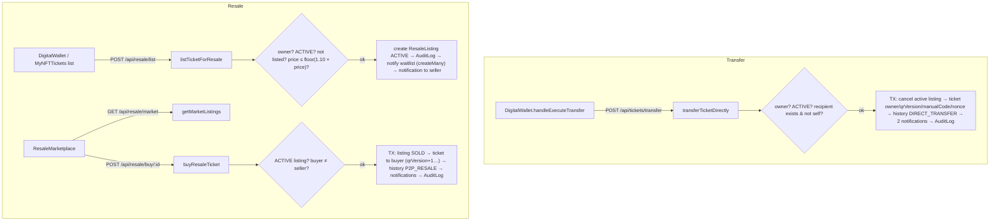

# Module: Ticket transfers, fan resale & waitlist

[← Modules](README.md) · Functions: [transfers, resale & NFT](../functions/api-resale-transfer-nft.md) · Journey: [7](../03-journeys.md#journey-7--transfer-and-resale)

## Overview

- **Direct transfer:** the owner gives an `ACTIVE` ticket to another registered user by e-mail. Free.
- **Fan resale:** the owner lists an `ACTIVE` ticket at **at most 110 %** of its original price; any other signed-in customer can "buy" it. **No payment is processed** — ownership simply moves.
- **Waitlist:** on a sold-out event page, users join a waitlist; they are notified when a ticket of that event is listed for resale.

Both transfer paths rewrite the same `Ticket` row: new `userId`, `qrVersion + 1`, `manualCode = null`, new legacy `qrNonce`, and record `TicketTransferHistory`. Blockchain ownership is **not** updated.

## Behind the scenes

| Step | File → function | Tables |
|---|---|---|
| Transfer | `ticketTransferController.transferTicketDirectly` | `Ticket`, `ResaleListing`, `TicketTransferHistory`, `Notification`×2, `AuditLog`, `BehaviorEvent` |
| List | `resaleController.listTicketForResale` | `ResaleListing`, `AuditLog`, `Notification` (+ waitlist), `Waitlist.notified` |
| Browse | `resaleController.getMarketListings` | reads `ResaleListing`, `Ticket`, `Event`, `Seat` |
| Buy | `resaleController.buyResaleTicket` | `ResaleListing`, `Ticket`, `TicketTransferHistory`, `Notification`×2, `AuditLog` |
| Cancel | `resaleController.cancelResaleListing` | `ResaleListing`, `Notification` |
| Waitlist | `joinEventWaitlist`, `getEventWaitlistStatus` | `Waitlist` |
| History | `getTicketTransferHistory`, `getMyTransferHistory` | reads `TicketTransferHistory` |

**Effect at the gate:** the previous owner's QR now has an old `qrVersion` → RED "Old QR". The new owner's wallet shows a fresh pass and manual code.

## Authorization and ownership checks
Transfer and listing require `ticket.userId === caller`; cancelling requires seller or admin; buying requires a different user. **Not checked (observed):** that the ticket's order is paid (a placeholder ticket of an unpaid checkout has status ACTIVE), recipient account status, and ownership for `GET /tickets/:ticketId/transfer-history` (exposes names/e-mails).

## Concurrency (observed)
Transfers run in one transaction but the ownership check happens before it. `buyResaleTicket` checks `status === 'ACTIVE'` outside the transaction and updates the listing unconditionally, so two simultaneous buyers can both succeed (the last write owns the ticket). A conditional `updateMany({id, status:'ACTIVE'})` would close this.

## Failure behaviour
404/403/400/409 as listed in the function catalogue; transfer validation errors become 500 (no Zod branch); waitlist notification errors are logged, not returned.

## Worked example (fictional)
Hina's ticket T1 cost PKR 3,000 → cap `floor(3300)` = 3,300. She lists at 3,500 → 400 "Anti-scalping violation: Maximum allowed resale price is Rs. 3,300". She lists at 3,300 → listing L1; 2 waitlisted users get "🎟️ Resale Ticket Available!" (+ e-mail). Omar buys L1 → L1 SOLD; T1 owner = Omar, qrVersion 1→2; history row `P2P_RESALE` price 3,300; Hina's notification says "Funds have been credited" although no payment occurred.
