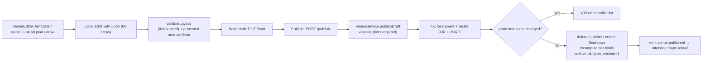

# Module: Venue plans & seating (venue editor, seat generation, attendee map)

[← Modules](README.md) · Functions: [venues & seats](../functions/api-venues-seats.md) · [venue components](../functions/web-components.md#venue--attendee-seat-map-shared-with-the-editor-preview) · [VenueEditor page](../functions/web-pages.md#venueeditor--organizereventsidvenue--venueeditorjsx114)

## Overview

Organizers draw their venue as **sections** (arcs, rotated blocks or free polygons) over a template or an uploaded plan image, and configure each section as numbered **rows of seats**, **tables** (sold per chair or as a whole table) or **general admission** (a capacity sold by quantity). The shared library `apps/venue-core` turns that configuration into exact seat positions and stable keys. Publishing a plan creates/updates one `Seat` row per bookable position. Attendees book on the same drawing.

## What a layout looks like (stored in `VenueLayout.data`, JSON)
```json
{ "version": 1, "template": "cricket",
  "coordinate": { "width": 1100, "height": 1100 },
  "background": null,
  "feature": { "kind": "cricket", "x": 550, "y": 550, "w": 500, "h": 470, "rotation": 0 },
  "sections": [
    { "id": "sec_abc12", "name": "Pavilion", "booking": "seats", "tierId": "<TicketTier id>",
      "shape": { "type": "arc", "cx": 550, "cy": 550, "r0": 275, "r1": 405, "a0": -104, "a1": -76 },
      "rows": { "count": 13, "seatsPerRow": 12, "perRow": {"0": 10}, "aisles": [], "blocked": ["0:3"], "numbering": "ltr" } }
  ] }
```

## Behind the scenes

### Seat generation (`venue-core/generate.js`)
1. Merge section settings with defaults (`rowsOf`, `tablesOf`, `gaOf`).
2. Build a **track** per row: arcs → concentric radius `r0 + inset + rowSpacing·(i+½)`; blocks/polygons → horizontal lines in the section's own rotated frame, width from the shape (polygons use `widestChord`), optional bow.
3. Place `n` seats along the track at `p·seatSpacing + aisles·aisleWidth`, centred; number left-to-right or right-to-left.
4. Produce keys `<sectionId>/<row>/<number>`, flags for blocked seats, and **issues** (row doesn't fit, seats outside boundary, duplicate labels, limits).
5. Tables: grid of round tables with chairs on a ring; GA: just a capacity.
Because this function is deterministic and shared, the editor preview, attendee map and API seat rows always agree.

### Editor → draft → publish


| # | Step | File → function |
|---|---|---|
| 1 | Load editor payload (tiers, draft, published, protected keys, legacy counts) | `VenueEditor.load` → `venueController.getEditor` → `editorPayload` |
| 2 | Start from template | `buildTemplate` + `assignTiers` (venue-core) |
| 3 | Upload background | `uploadPlan` → `POST /plan-image` → `validateEventImage('venuePlan')` + `uploadFile` |
| 4 | Edit sections | `addSection`, `finishDrawing`, `EditorOverlay`, `SectionInspector`, `toggleBlocked` |
| 5 | Live validation | `validateLayout` (browser) + conflict check against `protected` |
| 6 | Save draft | `saveDraft` → `venueController.saveDraft` (stores even with errors) |
| 7 | Publish | `publish` → `venueController.publish` → `venueService.publishDraft` |
| 8 | Notify | notification `EVENT_SEATING_SAVED`; socket `venue:published` |
| 9 | Preview as attendee | `previewAdapter` + `VenueBooking preview` (no server calls) |

**Protected seats** = sold, ticketed (in a checkout) or held right now. Publishing may not remove them, change their section name/row/number/kind/table, change their tier or block them. Free seats whose identity changes are deleted and recreated (their ids change).

**Tier quantities come from the plan:** after publishing, `TicketTier.totalQuantity` = non-blocked seats of that tier and `availableQuantity` = total − seats with tickets. The quantities typed in the create-event form are only a starting estimate.

### Attendee map
`SeatMap` → `VenueBooking` loads `GET /api/venues/event/:id` (layout + per-section counts + `unavailable` keys + my holds), draws sections, zooms into a section on click (`useCamera`), shows seat states (available / held / sold / blocked / mine, each with a symbol), and holds through the [seat-locking flow](seat-locking-holds.md). Large venues show only section shapes until a section is opened (level of detail).

### Legacy grid
Older events have `Seat` rows without `layoutKey` created by `POST /api/seats/generate-grid` or the seed. `scripts/migrate-legacy-venues.mjs` can wrap such grids in a plan without recreating seats. `publishDraft` refuses to replace a legacy grid that has bookings.

## Failure behaviour
Invalid plan → 400 with `errors`; conflicts → 409 with up to 50 messages; publish transaction timeout 60 s; editor warns on unload with unsaved changes; plan image validated in browser and server (type, ≥1000×600 long/short side, ≤10 MB).

## Worked example (fictional)
Organizer of *Karachi Qawwali Night* picks template `qawwali`, assigns tier "Front Rows" (PKR 4,000) to a 5-row section of 20 seats and blocks seat A-1 (`"0:0"`). Publish: `layoutInventory` yields 100 positions; seat A-1 is created `BLOCKED`; tier total = 99, available 99. Later, with seat C-5 sold, the organizer reduces the section to 2 rows (removing rows C–E) → publish returns 409 "Front Rows · Row C · 5 is booked but was removed from the plan."
