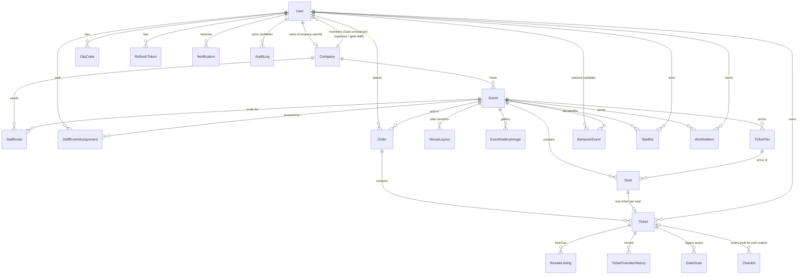

# Database (PostgreSQL via Prisma)

[← Start here](README.md) · Related: [API catalogue](06-api-catalogue.md) · [State, realtime & config](09-state-realtime-config.md) · Schema file: `apps/api/prisma/schema.prisma`

**Terms.** *Prisma* is the ORM (object–relational mapper): `schema.prisma` declares tables ("models"), and the generated `@prisma/client` gives JavaScript methods such as `prisma.ticket.findMany()`. *Enum* = a column restricted to a fixed list of values. *Cascade* = deleting the parent row deletes the children automatically.

**How the schema is applied.** There is **no `prisma/migrations` folder**. The schema is pushed with `npx prisma db push` (`npm run prisma:push` in `apps/api`). Changes that rename enum values or move data were done by one-off scripts (`apps/api/scripts/migrate-auth-overhaul.mjs`, `migrate-legacy-venues.mjs` — see [scripts](functions/scripts-tests-infra.md)). The single shared client lives in [`config/prisma.js`](functions/api-core.md#api-config-prisma); it is extended so every `Notification` insert is also e-mailed.

---

## 1. Entity-relationship diagram

Plain-text summary (for readers without Mermaid): **User** 1—0..1 **Company** (owner) · Company 1—* **Event** · Event 1—* **TicketTier**, **Seat**, **VenueLayout**, **EventGalleryImage** · TicketTier 1—* Seat · **Order** (User × Event) 1—* **Ticket** · Seat 1—0..1 Ticket (`Ticket.seatId` unique) · Ticket 1—* **ResaleListing**, **TicketTransferHistory**, **GateScan**, **CheckIn** · User 1—* **Notification**, **BehaviorEvent**, **AuditLog**, **Waitlist**, **WishlistItem**, **OtpCode**, **RefreshToken** · **StaffInvite**/**StaffEventAssignment** link gate staff to events.

## 2. Enums

| Enum | Values | Where it matters |
|---|---|---|
| `Role` | CUSTOMER, ORGANIZER, GATE_STAFF, SUPER_ADMIN | `requireRole`, `ProtectedRoute`, menus |
| `AccountStatus` | PENDING_VERIFICATION, ACTIVE, SUSPENDED, BANNED, DEACTIVATED, FROZEN, BLACKLISTED | `authenticateJWT` rejects the last five (`BLOCKED_STATUSES`) and pending accounts |
| `OtpPurpose` | VERIFY_EMAIL, RESET_PASSWORD | `otpService` |
| `InviteStatus` | PENDING, ACCEPTED, CANCELLED, EXPIRED | staff invites |
| `CompanyStatus` | PENDING, APPROVED, REJECTED, SUSPENDED | organizer event creation requires APPROVED |
| `EventType` | 11 types (CRICKET_MATCH … GENERAL_ADMISSION) | templates, ML type mapping, artwork |
| `EventStatus` | DRAFT, PRELAUNCH_ANALYSIS, PENDING_APPROVAL, REJECTED, PUBLISHED, PAUSED, COMPLETED, CANCELLED | visibility, booking (`PUBLISHED` only) |
| `SeatKind` | SEAT, GA_SLOT, TABLE_SEAT | GA quantities and whole tables are held through `/api/venues` |
| `VenueLayoutStatus` | DRAFT, PUBLISHED, ARCHIVED | one draft per event; publishing archives the previous version |
| `SeatStatus` | AVAILABLE, LOCKED, SOLD, BLOCKED | locking (see [seat locking](02-modules/seat-locking-holds.md)) |
| `OrderStatus` | PENDING, SUCCESSFUL, FAILED | checkout life-cycle |
| `PaymentMethod` | STRIPE, JAZZCASH, EASYPAISA, MOCK | STRIPE real in test mode when configured; others simulated (`paymentService`) |
| `TicketStatus` | ACTIVE, SCANNED, TRANSFERRED, RESOLD, CANCELLED | gate verdicts; **TRANSFERRED/RESOLD/CANCELLED are never set by current code** (transfers keep ACTIVE) |
| `GateScanResult` | VALID_FIRST_SCAN, ALREADY_SCANNED, INVALID_SCAN | legacy `GateScan` |
| `CheckInResult` | GREEN, YELLOW, RED | current `CheckIn` |
| `ResaleStatus` | ACTIVE, SOLD, CANCELLED | resale |
| `TransferType` | DIRECT_TRANSFER, P2P_RESALE | transfer history |

## 3. Tables — purpose and important columns

| Table | Purpose | Key columns / constraints | Notes |
|---|---|---|---|
| `User` | Every account | `email` unique, `phone` unique, `walletAddress` unique, `role`, `status`, `companyId` (organizer's own or staff employer), notification toggles | Legacy columns `otpCode`, `otpExpiresAt`, `isVerified` still exist in the schema but are not used by current code (OTP lives in `OtpCode`) — *observed: no reads/writes found*. |
| `OtpCode` | One-time codes | `codeHash` (HMAC), `expiresAt` (10 min), `attempts` (max 5), `consumedAt` | Index (userId, purpose). |
| `RefreshToken` | Sessions | `tokenHash` unique (SHA-256), `expiresAt` (7 days), `revokedAt` | Rotation and reuse detection in `tokenService`. |
| `StaffInvite` | Gate staff invitations | `tokenHash` unique, `status`, `expiresAt` (72 h) | Cascade on company/event delete. |
| `StaffEventAssignment` | Which events a staff member may scan | PK (staffId, eventId) | Source of `getScopedEventIds` for GATE_STAFF. |
| `Company` | Organizer company & verification | `userId` unique, `status`, `documentUrl`, `rejectionReason`, `reviewedBy/At` | |
| `Event` | Events | `status`, `date` (UTC midnight) + `time` string (PKT), location, media URLs, review fields | Indexes city/type/status. Delete cascades to tiers, seats, layouts, gallery, wishlist, waitlist, invites, assignments. |
| `EventGalleryImage` | Ordered gallery | `position` | |
| `TicketTier` | Price categories | `price` Decimal(10,2), `totalQuantity`, `availableQuantity` | `availableQuantity` is decremented when a checkout **starts** and restored when it fails/expires; recomputed on plan publish. |
| `Seat` | Every bookable position | unique (eventId, section, row, seatNumber); unique (eventId, layoutKey); `status`, `lockedUntil`, `lockedByUserId`, `kind`, `tableKey`, `wholeTable` | `layoutKey` null = legacy grid seat. The lock lives in these columns (PostgreSQL is the source of truth). |
| `VenueLayout` | Organizer plan (JSON) | `status`, `version`, `data` Json, `template` | |
| `Order` | A checkout | `totalAmount`, `status`, `paymentMethod`, `paymentTxId` | No cascade from Event (event delete removes orders explicitly first). |
| `Ticket` | One admission | `seatId` **unique** (prevents double sale), `userId` (current owner), token fields, `qrNonce` (legacy), `qrVersion` (+1 on transfer), `manualCode` unique, `checkedInAt/ById`, `gate` | Placeholder tickets are created at checkout start with status ACTIVE while the order is PENDING. `qrSignature`, `qrIssuedAt`, `pdfUrl` are not used by current pass logic (`qrIssuedAt` is updated on transfer only). |
| `ResaleListing` | Fan resale | `resalePrice`, `maxResalePrice` (110 % cap, computed in API) | `buyerId` has no relation. |
| `GateScan` | Legacy scan log | `result`, `gateNumber` | Still written (mirrored) by current check-in; read by dashboards. |
| `CheckIn` | Current scan log (every scan) | `result`, `reason`, `offline`, `conflict`, `deviceId`, `scannedAt`, `syncedAt` | `ticketId` SetNull on delete. |
| `BehaviorEvent` | Behaviour telemetry + stored ML evaluations | `sessionId`, `action` (free text), `eventId`, `metadata` Json | Indexes session/user/action/createdAt. |
| `Notification` | In-app notifications | `type` (free text), `isRead` | Insert ⇒ e-mail via Prisma extension. |
| `AuditLog` | Admin/security trail | `action`, `targetType/Id`, `details` Json | `ipAddress` column is never filled by current code. |
| `TicketTransferHistory` | Ownership moves | type, price, old/new nonce, txHash | |
| `Waitlist` | Sold-out interest | unique (eventId, userId), `notified` | Only resale listing notifies. |
| `WishlistItem` | Saved events | unique (userId, eventId) | |

## 4. Integrity and concurrency mechanisms (observed)

| Mechanism | Where | Protects against |
|---|---|---|
| `Ticket.seatId` unique | schema | Two orders for one seat (a racing insert fails with `P2002` → 409 in `initiateBooking`). |
| Atomic `UPDATE … WHERE free RETURNING` (`FREE_SQL`) | `venueService.holdSeat/holdTable/setGaQuantity`, `seatController.lockSeat` | Two users locking one seat. |
| `FOR UPDATE SKIP LOCKED` | `setGaQuantity` | GA buyers blocking each other. |
| `SELECT … FOR UPDATE` on Event and Seats | `publishDraft` | Holds/checkouts racing a plan publish. |
| Conditional status transitions (`updateMany where status=…`) | `confirmBooking`, `cancelBooking`, `expireStaleHolds`, `releaseHolds`, `reviewEvent`, `acceptInvite`, `consumeOtp`, `rotateRefreshToken`, `checkinService.scan` | Double confirmation, double review, OTP/invite reuse, double admission. |
| `$transaction` | booking, transfers, resale, event create/update/delete, OTP issue, invite accept/create, publish | Partial writes. |
| **Missing** | `resaleController.buyResaleTicket` (unconditional listing update), `qrTicketService.processGateScan` (legacy) | Concurrent duplicate purchase / admission. |

## 5. Who reads and writes each table

Generated by a static scan of `apps/api/src` for `prisma.<model>.<operation>(` / `tx.<model>…` calls, attributed to the enclosing top-level function (`file.function`). **Raw SQL writes to `Seat` are not in the table below**: `seatController.lockSeat`, `venueService.holdSeat`, `holdTable`, `setGaQuantity`, `expireStaleHolds` and the `FOR UPDATE` reads in `publishDraft` use `$queryRaw`. Scripts and seeds are excluded except `src/seed.js`.

| Table | Written by (function) | Read by (function) |
|---|---|---|
| `User` | `adminService.updateUserStatus`, `authController.acceptInvite`, `authController.resetPassword`, `authController.signup`, `authController.updatePendingSignup`, `authController.verifyOtp`, `companyController.registerCompany`, `mlController.freezeUserAccount`, `mlController.unfreezeUserAccount`, `notificationController.registerFCMToken`, `seed.seedUsers`, `staffController.deactivateStaff`, `staffController.reactivateStaff`, `userController.changePassword`, `userController.updateNotifications`, `userController.updateProfile`, `userController.updateWallet` | `adminService.getSuperAdminMetrics`, `adminService.getUsersList`, `adminService.updateUserStatus`, `auth.authenticateJWT`, `auth.optionalAuth`, `authController.acceptInvite`, `authController.buildAuthUser`, `authController.findPendingSignupUser`, `authController.forgotPassword`, `authController.login`, `authController.resendOtp`, `authController.resetPassword`, `authController.signup`, `authController.updatePendingSignup`, `authController.verifyOtp`, `behaviorService.getUserBehavioralProfile`, `eventReviewController.submitEventForReview`, `intentAnalyticsService.sendAbandonedCartReminder`, `intentAnalyticsService.sendAttendeeReminder`, `mlController.freezeUserAccount`, `mlController.unfreezeUserAccount`, `notificationService.dispatchNotification`, `prisma.emailNotifications`, `seed.seedUsers`, `staffController.createInvite`, `staffController.deactivateStaff`, `staffController.listStaff`, `staffController.reactivateStaff`, `staffController.resendInvite`, `staffController.revokeEventAccess`, `ticketTransferController.transferTicketDirectly`, `userController.changePassword`, `userController.getProfile`, `userController.updateWallet` |
| `StaffInvite` | `authController.acceptInvite`, `authController.findUsableInvite`, `staffController.cancelInvite`, `staffController.createInvite`, `staffController.expireStaleInvites`, `staffController.resendInvite` | `authController.findUsableInvite`, `staffController.cancelInvite`, `staffController.listStaff`, `staffController.resendInvite` |
| `StaffEventAssignment` | `authController.acceptInvite`, `staffController.createInvite`, `staffController.revokeEventAccess` | `accessService.getScopedEventIds` |
| `Order` | `bookingController.cancelBooking`, `bookingController.confirmBooking`, `bookingController.initiateBooking`, `eventController.deleteEvent`, `venueService.expireStaleHolds`, `venueService.releaseHolds` | `adminService.getAllTransactionsAdmin`, `adminService.getSuperAdminMetrics`, `behaviorController.getUserBehaviorProfileById`, `bookingController.cancelBooking`, `bookingController.confirmBooking`, `bookingController.getBookingById`, `bookingController.getMyBookings`, `eventController.deleteEvent`, `intentAnalyticsService.getAbandonedIntentDashboard`, `intentAnalyticsService.getEventIntentAnalytics`, `nftService.batchMintOrderTickets`, `organizerDashboardService.getOrganizerDashboardMetrics`, `ticketController.mintOrderNFTs`, `userController.getProfile`, `venueService.expireStaleHolds`, `venueService.releaseHolds` |
| `Event` | `eventController.createEvent`, `eventController.deleteEvent`, `eventController.updateEvent`, `eventController.updateEventStatus`, `eventReviewController.reviewEvent`, `eventReviewController.submitEventForReview`, `seed.seedUsers` | `accessService.getScopedEventIds`, `adminService.getAllEventsAdmin`, `adminService.getSuperAdminMetrics`, `bookingController.initiateBooking`, `checkinController.myEvents`, `checkinService.broadcast`, `checkinService.eventPack`, `eventController.createEvent`, `eventController.deleteEvent`, `eventController.getEventById`, `eventController.getEventForEdit`, `eventController.getEvents`, `eventController.getOrganizerEvents`, `eventController.getPreLaunchDemandForecast`, `eventController.publishEventWithPricing`, `eventController.updateEvent`, `eventController.updateEventPricing`, `eventController.updateEventStatus`, `eventReviewController.getSubmissionStatus`, `eventReviewController.listEventsForReview`, `eventReviewController.reviewEvent`, `eventReviewController.submitEventForReview`, `gateController.getEventGateStats`, `intentAnalyticsService.getAbandonedIntentDashboard`, `intentAnalyticsService.getEventIntentAnalytics`, `intentAnalyticsService.sendAbandonedCartReminder`, `intentAnalyticsService.sendAttendeeReminder`, `organizerDashboardService.getOrganizerDashboardMetrics`, `seatController.generateSeatGrid`, `seatController.getEventSeatMap`, `seed.seedUsers`, `staffController.createInvite`, `staffController.getMyGateEvents`, `staffController.listInvitableEvents`, `staffController.revokeEventAccess`, `ticketTransferController.joinEventWaitlist`, `userController.getProfile`, `venueController.managedEvent`, `venueService.assertBookable`, `venueService.autoProvisionVenueLayout`, `venueService.getAvailability`, `wishlistController.addToWishlist` |
| `BehaviorEvent` | `behaviorService.attachSessionToUser`, `behaviorService.getUserBehavioralProfile`, `behaviorService.trackBehavior`, `bookingController.initiateBooking`, `mlController.checkFraud`, `mlController.forecastDemand`, `mlController.scoreIntent` | `adminService.getFraudAlerts`, `behaviorService.getUserBehavioralProfile`, `intentAnalyticsService.getAbandonedIntentDashboard`, `intentAnalyticsService.getEventIntentAnalytics`, `mlController.getFraudWatchlist`, `mlController.getPredictionHistory`, `organizerDashboardService.getOrganizerDashboardMetrics` |
| `AuditLog` | `adminService.updateUserStatus`, `bookingController.confirmBooking`, `bookingController.initiateBooking`, `companyController.registerCompany`, `companyController.updateCompanyStatus`, `eventController.createEvent`, `eventController.deleteEvent`, `eventController.publishEventWithPricing`, `eventController.updateEvent`, `eventReviewController.reviewEvent`, `eventReviewController.submitEventForReview`, `intentAnalyticsService.sendAbandonedCartReminder`, `intentAnalyticsService.sendAttendeeReminder`, `mlController.checkFraud`, `mlController.freezeUserAccount`, `mlController.trainModel`, `mlController.unfreezeUserAccount`, `nftService.mintTicketNFT`, `resaleController.buyResaleTicket`, `resaleController.listTicketForResale`, `staffController.deactivateStaff`, `staffController.reactivateStaff`, `staffController.revokeEventAccess`, `ticketTransferController.transferTicketDirectly`, `userController.changePassword`, `userController.updateProfile`, `userController.updateWallet`, `venueService.publishDraft` | `adminService.getAuditLogs`, `adminService.getSuperAdminMetrics`, `userController.getAccountHistory` |
| `Seat` | `bookingController.cancelBooking`, `bookingController.confirmBooking`, `seatController.generateSeatGrid`, `seatController.unlockSeat`, `venueService.autoProvisionVenueLayout`, `venueService.expireStaleHolds`, `venueService.publishDraft`, `venueService.releaseHolds`, `venueService.setGaQuantity` | `bookingController.initiateBooking`, `eventReviewController.getSubmissionStatus`, `eventReviewController.seatingReady`, `seatController.getEventSeatMap`, `seatController.lockSeat`, `seatController.unlockSeat`, `venueController.editorPayload`, `venueService.activeHoldsForUser`, `venueService.autoProvisionVenueLayout`, `venueService.getAvailability`, `venueService.holdSeat`, `venueService.holdTable`, `venueService.myOpenHoldCount`, `venueService.protectedKeys`, `venueService.publishDraft`, `venueService.releaseHolds`, `venueService.setGaQuantity` |
| `Ticket` | `bookingController.cancelBooking`, `bookingController.initiateBooking`, `checkinService.scan`, `checkinService.syncOffline`, `nftService.mintTicketNFT`, `qrPassService.assignManualCode`, `qrTicketService.processGateScan`, `resaleController.buyResaleTicket`, `ticketTransferController.transferTicketDirectly`, `venueService.autoProvisionVenueLayout`, `venueService.expireStaleHolds`, `venueService.releaseHolds` | `adminService.getBlockchainLogs`, `adminService.getSuperAdminMetrics`, `bookingController.initiateBooking`, `checkinService.evaluate`, `checkinService.eventPack`, `checkinService.eventStats`, `gateController.getDynamicRotatingQR`, `intentAnalyticsService.getAbandonedIntentDashboard`, `nftService.mintTicketNFT`, `qrTicketService.processGateScan`, `qrTicketService.verifyTicketQR`, `resaleController.listTicketForResale`, `ticketController.downloadTicketPDF`, `ticketController.getCustomerWallet`, `ticketController.getMyNFTTickets`, `ticketController.getNFTTicketById`, `ticketController.getTicketQR`, `ticketTransferController.transferTicketDirectly`, `userController.getProfile`, `venueService.autoProvisionVenueLayout` |
| `TicketTier` | `bookingController.cancelBooking`, `bookingController.initiateBooking`, `eventController.createEvent`, `eventController.publishEventWithPricing`, `eventController.updateEventPricing`, `seed.seedUsers`, `venueController.createTier`, `venueService.autoProvisionVenueLayout`, `venueService.expireStaleHolds`, `venueService.publishDraft`, `venueService.releaseHolds` | `organizerDashboardService.getOrganizerDashboardMetrics`, `seatController.generateSeatGrid`, `venueController.editorPayload`, `venueController.saveDraft`, `venueService.publishDraft` |
| `Notification` | `bookingController.confirmBooking`, `companyController.registerCompany`, `companyController.updateCompanyStatus`, `eventController.createEvent`, `eventController.deleteEvent`, `eventController.updateEvent`, `eventReviewController.reviewEvent`, `eventReviewController.submitEventForReview`, `notificationController.deleteNotification`, `notificationController.markAllNotificationsAsRead`, `notificationController.markNotificationAsRead`, `notificationService.dispatchNotification`, `resaleController.buyResaleTicket`, `resaleController.cancelResaleListing`, `resaleController.listTicketForResale`, `staffController.reactivateStaff`, `staffController.revokeEventAccess`, `ticketTransferController.transferTicketDirectly`, `userController.changePassword`, `userController.updateProfile`, `userController.updateWallet`, `venueController.publish` | `notificationController.deleteNotification`, `notificationController.getMyNotifications`, `notificationController.markNotificationAsRead` |
| `CheckIn` | `checkinService.logScan` | `checkinController.recent`, `checkinService.eventStats` |
| `Company` | `companyController.registerCompany`, `companyController.updateCompanyStatus`, `seed.seedUsers` | `accessService.getOwnedCompanyId`, `accessService.getScopedEventIds`, `adminService.getSuperAdminMetrics`, `auth.requireApprovedCompany`, `companyController.getAllCompanies`, `companyController.getMyCompany`, `companyController.registerCompany`, `companyController.updateCompanyStatus`, `eventAccess.canManageEvent`, `eventController.getOrganizerEvents`, `eventController.getPreLaunchDemandForecast`, `eventController.publishEventWithPricing`, `eventController.updateEventPricing`, `eventController.updateEventStatus`, `intentAnalyticsService.getAbandonedIntentDashboard`, `organizerDashboardService.getOrganizerDashboardMetrics`, `seed.seedUsers`, `staffController.listInvitableEvents`, `userController.getProfile` |
| `EventGalleryImage` | `eventController.updateEvent` |  |
| `VenueLayout` | `venueController.discardDraft`, `venueController.saveDraft`, `venueService.autoProvisionVenueLayout`, `venueService.publishDraft` | `eventReviewController.getSubmissionStatus`, `eventReviewController.seatingReady`, `seatController.generateSeatGrid`, `venueController.editorPayload`, `venueController.listReusable`, `venueController.saveDraft`, `venueService.assertBookable`, `venueService.getAvailability`, `venueService.publishDraft` |
| `GateScan` | `checkinService.logScan`, `qrTicketService.processGateScan` | `adminService.getGateScanLogs`, `adminService.getSuperAdminMetrics`, `gateController.getEventGateStats`, `gateController.getRecentScans`, `organizerDashboardService.getOrganizerDashboardMetrics`, `userController.getProfile` |
| `ResaleListing` | `resaleController.buyResaleTicket`, `resaleController.cancelResaleListing`, `resaleController.listTicketForResale`, `ticketTransferController.transferTicketDirectly` | `resaleController.buyResaleTicket`, `resaleController.cancelResaleListing`, `resaleController.getMarketListings`, `resaleController.getMyListings` |
| `Waitlist` | `resaleController.listTicketForResale`, `ticketTransferController.joinEventWaitlist` | `resaleController.listTicketForResale`, `ticketTransferController.getEventWaitlistStatus`, `ticketTransferController.joinEventWaitlist` |
| `TicketTransferHistory` | `resaleController.buyResaleTicket`, `ticketTransferController.transferTicketDirectly` | `ticketTransferController.getMyTransferHistory`, `ticketTransferController.getTicketTransferHistory` |
| `RefreshToken` | `tokenService.issueRefreshToken`, `tokenService.revokeAllRefreshTokens`, `tokenService.revokeRefreshToken`, `tokenService.rotateRefreshToken`, `userController.changePassword` | `tokenService.rotateRefreshToken` |
| `WishlistItem` | `wishlistController.addToWishlist`, `wishlistController.removeFromWishlist` | `wishlistController.getWishlist`, `wishlistController.getWishlistIds` |
| `OtpCode` | `otpService.consumeOtp`, `otpService.issueOtp` | `otpService.consumeOtp`, `otpService.getOtpTiming`, `otpService.otpCooldownRemaining` |
